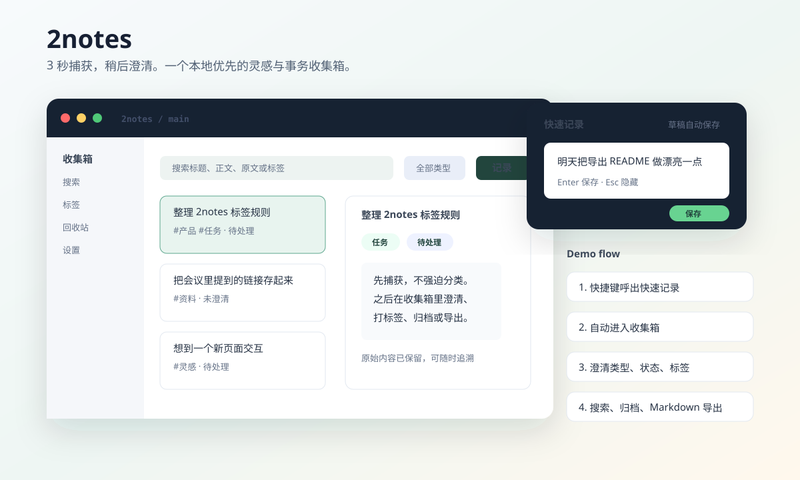

# 2notes

> 不丢想法，不漏事务，不怕混乱。

2notes 是一个 Windows 桌面端的个人灵感与事务收集箱。它不是传统笔记软件，也不是完整待办系统；它更像一个安静待命的捕获入口：想到什么，先丢进去，稍后再澄清、处理、归档或导出。



## 它解决什么

很多想法和待办不是在“准备写笔记”的时候出现的，而是在写代码、聊天、查资料、开会、复制链接的间隙突然冒出来。2notes 的第一目标是把这些碎片稳稳接住：

- 全局快捷键呼出快速记录，不打断当前工作。
- 自动保存草稿和详情编辑，尽量不让内容因为窗口关闭、切换或退出丢掉。
- 每条记录保留“原始内容 + 当前内容”，后续整理不覆盖最初的想法。
- 用类型、状态和标签做轻量澄清，不把收集箱变成复杂管理系统。
- 将未进入回收站的记录导出为 Markdown，数据始终在本机，能迁移、能备份、能带走。

## Demo：一次典型使用

1. 正在做别的事，按 `Ctrl + Alt + Space` 呼出快速记录。
2. 输入一句想法、一个待办或一段链接备注，按 `Enter` 保存。
3. 内容进入收集箱，默认是“未澄清 / 待处理”。
4. 回头在主窗口里补标题、改类型、打标签、标记完成或归档。
5. 需要迁移时，在设置页导出未进入回收站的记录；每条导出记录生成一个 `.md` 文件，带 YAML frontmatter 和原始内容追溯区。

## 当前能力

- 快速记录窗口：快捷键呼出、Enter 提交、Esc 隐藏、单份草稿恢复。
- 主窗口：收集箱、搜索、标签、回收站、设置。
- 条目模型：标题、原始内容、当前内容、类型、状态、标签、修订号。
- 自动保存：详情编辑 debounce 保存，切换条目/视图/退出前会先 flush。
- 搜索筛选：标题、当前内容、原始内容、标签名；支持类型、状态、标签筛选。
- 回收站：普通删除先移入回收站，永久删除只允许在回收站内发生。
- Markdown 导出：仅导出未进入回收站的记录，文件名自动清理和避让，不覆盖已有文件。
- 本地优先：SQLite 主存储，Tauri/Rust 负责本地能力，不做远程遥测。
- Windows 集成：系统托盘、开机自启动开关、全局快捷键、安装包构建。

## 构建产物

运行：

```bash
pnpm install
pnpm run tauri:build
```

构建完成后会生成：

- 应用可执行文件：`src-tauri/target/release/two_notes.exe`
- MSI 安装包：`src-tauri/target/release/bundle/msi/2notes_0.2.0_x64_en-US.msi`
- NSIS 安装包：`src-tauri/target/release/bundle/nsis/2notes_0.2.0_x64-setup.exe`

这些产物不会提交到仓库；GitHub Actions 会在 `tauri-build` job 中验证真实打包链路。

## 开发

```bash
pnpm install
pnpm run tauri:dev
```

常用检查：

```bash
pnpm run lint
pnpm run typecheck
pnpm run test:unit
pnpm run build
cargo test --manifest-path src-tauri/Cargo.toml
cargo clippy --manifest-path src-tauri/Cargo.toml --all-targets --all-features -- -D warnings
```

技术栈：

- 前端：Vue 3、TypeScript、Pinia、UnoCSS、VueUse
- 桌面端：Tauri 2
- 本地能力：Rust
- 存储：SQLite / rusqlite
- 包管理：pnpm

## 数据与隐私

2notes 当前是个人本地工具。主动记录、草稿、标签和设置都保存在本机 SQLite 中；Markdown 导出也只写入用户选择的本地目录。

默认数据路径由 Tauri app data 目录管理，设置页会展示数据目录和日志目录，并提供打开入口。

## 项目状态

第一阶段已完成快速捕获、收集箱、自动保存、搜索筛选、标签、回收站、Markdown 导出、设置页、系统托盘、全局快捷键和 Windows 安装包构建。

最近一次本地验证通过：

- `pnpm run lint`
- `pnpm run typecheck`
- `pnpm run test:unit`
- `pnpm run build`
- `cargo test --manifest-path src-tauri/Cargo.toml`
- `cargo clippy --manifest-path src-tauri/Cargo.toml --all-targets --all-features -- -D warnings`
- `pnpm run tauri:build`

## 暂不做

第一阶段刻意不做 AI、云同步、多人协作、富文本、附件、提醒日程、账号体系、自动更新和远程上报。先把“快速捕获 + 不丢内容 + 可回捞整理”这条主线做稳。
