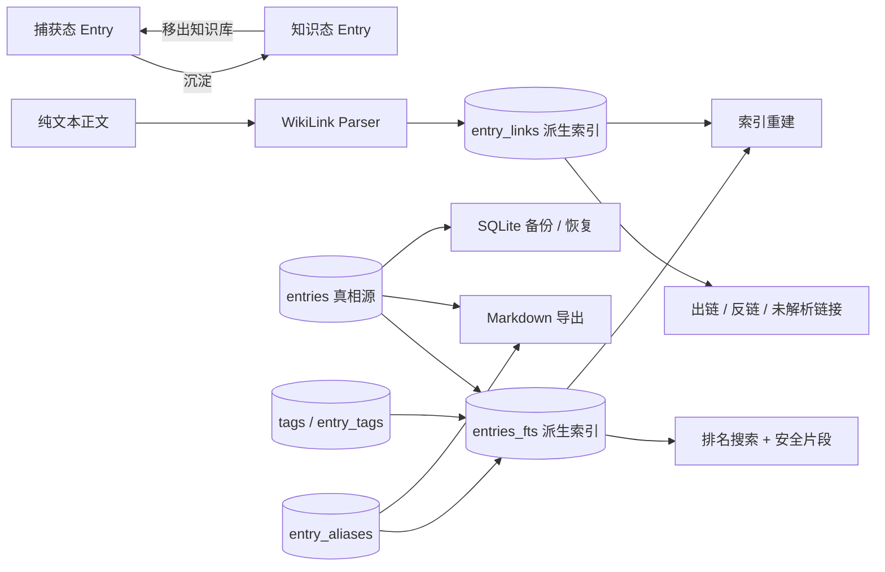

# 2notes 第二阶段 Codex 执行方案

> **面向 AI 代理的工作者：** 默认在独立分支中逐任务内联执行；每个生产代码修改前必须先写失败测试并确认红灯。只有用户明确授权并行代理时，才使用 `subagent-driven-development`。执行时同时遵循 `test-driven-development`、`systematic-debugging` 与 `ponytail`。

**目标：** 在不复制条目、不引入第二套主存储的前提下，把现有捕获条目演进为可沉淀、可双向关联、可检索、可导出的本地知识节点，交付 2notes `0.3.0` 的第二阶段知识库最小闭环。

**架构：** SQLite 继续是唯一真相源，`entries` 继续是唯一内容实体；第二阶段只增加知识状态、稳定标题键、历史标题别名和可重建的 `entry_links` 派生索引。搜索继续使用 SQLite FTS5，但将中文三字及以上查询切换到 trigram 索引并返回排序后的安全高亮片段；短查询保留 LIKE 回退。前端继续使用纯文本 `textarea`，只增加 `[[标题]]` 补全、知识库视图和关系面板，不引入富文本或块编辑器。

**技术栈：** Vue 3、TypeScript strict、Pinia、Tauri 2、Rust、rusqlite、SQLite/FTS5、Vitest、GitHub Actions、pnpm。

**执行保护：** 文中所有 commit/push 命令都只是授权后的检查点；未获用户授权时跳过 Git 写操作。任何带过滤条件的 Rust 测试都必须实际运行至少 1 个测试，输出 `running 0 tests` 一律视为失败，不能作为绿灯。

---

## 1. 当前基线与启动门槛

### 1.1 已确认的仓库状态

截至 2026-07-15，本计划基于以下事实编写：

- 当前分支：`refactor/deduplicate-architecture`。
- 当前工作树存在大量未提交的第一阶段全量审查修复，不能直接在其上叠加第二阶段功能。
- 当前实现已有：快速记录、草稿恢复、条目自动保存、类型/状态/标签、回收站、分页、FTS5、Markdown 导出、手动备份与恢复、托盘、全局快捷键、开机自启、Windows 打包。
- 当前实现没有：知识节点状态、双链/反链、知识库视图、历史标题别名、链接索引、中文子串排名搜索、搜索命中片段、Markdown 反向导入、剪贴板流水、块编辑器。
- 本次盘点实际通过：
  - `pnpm run lint`
  - `pnpm run typecheck`
  - `pnpm run test:unit`：9 个测试文件、30 个测试通过
  - `cargo test --manifest-path src-tauri/Cargo.toml`：44 个 Rust 测试通过
- 本次没有重新执行 `pnpm run tauri:build`、CDP 冒烟、依赖审计和完整人工回归，因此第二阶段开工前仍必须执行完整基线门禁。

### 1.2 第二阶段开工硬门槛

以下条件全部满足后才能创建第二阶段分支：

- [ ] `docs/superpowers/plans/2026-07-15-全量审查问题顺序修复计划.md` 对应改动已完成。
- [ ] 当前第一阶段改动已经过用户确认并形成提交点，不再处于混杂未提交状态。
- [ ] `参考项目/` 已确认只用于本地调研，并通过 `.git/info/exclude` 或项目既有忽略规则排除，不能靠执行时“记得别提交”。
- [ ] 完整 CI 门禁、Windows 打包和 CDP 冒烟通过。
- [ ] `docs/第二阶段人工测试表.xlsx` 中 EX-01 的旧语义已经确认需要在第二阶段文档任务中修正：Markdown 导出只包含 `deleted_at IS NULL` 条目，不包含回收站条目。
- [ ] 创建分支 `codex/stage-2-knowledge-base`，第二阶段所有改动只进入该分支。

基线命令：

```powershell
git status --short
git diff --stat
pnpm run format:check
pnpm run lint
pnpm run typecheck
pnpm run test:unit
pnpm run build
pnpm run audit:frontend
cargo fmt --manifest-path src-tauri/Cargo.toml --check
cargo test --manifest-path src-tauri/Cargo.toml
cargo clippy --manifest-path src-tauri/Cargo.toml --all-targets --all-features -- -D warnings
pnpm run audit:rust
pnpm run tauri:build
powershell -NoProfile -ExecutionPolicy Bypass -File scripts/test/2notes-quick-capture-cdp.ps1
```

预期：全部命令退出码为 0；CDP 脚本明确输出通过；此处不创建分支，分支只在任务 0 的提交点确认后创建，避免同一命令执行两次。

## 2. 方案选择与取舍

### 2.1 方案 A：SQLite 条目级知识图谱（推荐）

做法：继续把 `entries` 作为内容真相源，增加知识状态和稳定标题键；从 `current_content` 中解析 `[[标题]]`，把解析结果写入可删除、可重建的关系索引。

优点：

- 不改变当前自动保存、修订号、备份恢复、导出和 Tauri command 边界。
- 条目从捕获态直接变成知识节点，不发生复制和双份内容漂移。
- SQLite 事务可以保证“正文保存 + 关系索引更新”原子提交。
- 复用现有标签、状态、搜索、分页和 Markdown 导出。
- 不增加运行时依赖。

代价：

- 外部 Markdown 文件仍不是可写主库。
- 关系粒度是条目级，不是思源的块级。
- 标题需要在知识节点范围内保持唯一，才能让 `[[标题]]` 无歧义解析。

### 2.2 方案 B：Markdown Vault 作为第二主存储

做法：每个知识节点同时落成 Markdown 文件，监听外部文件变化并回写 SQLite。

优点：更接近 Obsidian，用户可以直接用外部编辑器修改。

缺点：立即产生 SQLite/文件双主写、文件监听、冲突、重命名、编码、原子写、恢复和跨程序锁问题；会破坏当前“不丢内容”的第一优先级。第二阶段不采用。

### 2.3 方案 C：复制思源的块级内核

做法：把每条内容拆成稳定块 ID、树结构、块引用、事务队列和块级索引。

优点：长期能力最强，可支持块引用、嵌入块和属性视图。

缺点：需要重写编辑器、数据模型、事务、撤销、搜索和导出；规模远超第二阶段，且与 2notes 的短条目定位冲突。第二阶段不采用。

### 2.4 决策

采用方案 A。只有出现以下任一证据时才重新评估：

- 用户明确要求在 Obsidian 中直接双向编辑同一知识库。
- 单条内容普遍发展为长文，条目级关系无法满足定位需求。
- 10 万级条目下同步关系索引更新经基准测试超过 300ms p95。

## 3. 对参考项目 `.zread` 的采用与拒绝

本计划读取的 active wiki 为 `参考项目/siyuan/.zread/wiki/versions/2026-07-08-004003`。重点核对了工作区与损坏隔离、启动生命周期、SQLite/FTS5 索引队列、事务与撤销、多视口事件、属性视图、编辑器渲染和 MCP/Agent 运行时；结论不是复制思源，而是只拿当前规模需要的稳定 ID、派生索引、事务一致性和安全事件边界。

| 思源设计 | 第二阶段处理 | 原因 |
|---|---|---|
| 稳定 ID 与引用索引 | 采用 | `entries.id` 已是 UUID，关系表只引用 ID，不把标题当外键 |
| 真实数据与 SQLite 派生索引分离 | 部分采用 | 2notes 的真实数据仍在 SQLite 主表；FTS 和 `entry_links` 明确视为可重建派生索引 |
| 损坏索引可重建 | 采用 | 设置页提供“重建搜索与关联索引”，重建在单事务内完成 |
| 写入串行化与事务提交 | 采用 | 复用 `AppState::with_write_tx` 和现有单写连接，不新增事务队列 |
| 高频索引内存队列 + 磁盘队列 | 不采用 | 2notes 是单进程、条目级低频写入；现阶段同步解析更短、更可靠 |
| 多窗口广播中心 | 简化采用 | 复用现有 Tauri `entries-changed` 事件，不引入 WebSocket 或新事件总线 |
| FTS 排名和 snippet | 采用 | 使用 `bm25()` 和 `snippet()`，后端解析标记后返回安全文本分段 |
| 块级树、IAL、属性视图 | 不采用 | 第二阶段保持条目级，不引入通用数据库和视图引擎 |
| WYSIWYG Protyle 编辑器 | 不采用 | 继续纯文本编辑，避免编辑器重写和 DOM 事务复杂度 |
| 全局 UndoLog | 不采用 | 第二阶段所有复合写入用 SQLite 单事务；删除继续依赖回收站和备份 |
| 插件、MCP、AI Agent | 不采用 | 产品文档明确 AI 不早于知识库完成后，插件与 MCP 不属于本阶段 |

### 3.1 其他调研项目映射

`docs/research/knowledge-base` 中的其他项目用于产品边界、交互和长期架构取舍，不作为源码级实现模板：

| 调研项目 | 吸收的设计 | 第二阶段明确不采用 |
|---|---|---|
| Obsidian | `[[标题]]`、反向链接面板、标题作为知识锚点、图谱只是发现工具 | Markdown 文件主存储、插件生态、图谱视图 |
| Logseq | 捕获内容可继续演进、文本与查询索引分层、状态与内容同源 | 大纲作为唯一编辑范式、块级树、每日页面、SRS |
| SiYuan | 稳定 ID、历史别名、派生引用索引、FTS snippet、索引重建和事务一致性 | 块内核、IAL、属性视图、Protyle、WebSocket、插件与 Agent |
| Trilium | 同一内容可被多角度组织、关系应指向稳定实体 | 多父节点树、自定义属性引擎、脚本系统、关系图谱 |
| Joplin | SQLite 保存结构化元数据、Markdown 保证可携带、导出是正式能力 | 多同步后端、E2EE、网页剪藏、CLI 和插件系统 |
| QOwnNotes | 数据可迁移、AI/MCP 应使用有限且标准化的访问边界 | Markdown 唯一主存储、Nextcloud 绑定、脚本和 MCP 提前进入第二阶段 |
| Foam | 无效链接可见、知识库健康问题应可诊断 | VS Code 依赖、Git 工作流、完整孤立节点健康中心 |
| Anytype | 本地优先、数据主权、对象关系必须有稳定 ID | 可自定义对象类型、P2P/CRDT 同步、工作空间系统 |
| AFFiNE | 本地优先产品需要控制复杂度，内容与呈现应分层 | Canvas、白板、CRDT、块系统和 AI 原生编辑 |
| Zettlr | 知识沉淀后仍要可导出，导出不能锁死用户数据 | Pandoc 出版管线、学术引用管理、模板系统 |
| AppFlowy | 数据主权、功能模块应保持清晰边界 | Notion 式数据库、看板、日历、工作场所 OS 和自托管服务端 |
| Outline | 速度优先，搜索和打开知识节点必须有可验证性能门槛 | 团队空间、GraphQL 服务端、白标、Slack 和协作 |
| RemNote | 派生能力不应复制来源内容；知识节点仍与原始 entry 同源 | 闪卡、SRS、学习工作流和大纲式编辑 |

因此其他调研项目确实影响了本计划，但主要体现在“只做什么”和“坚决不做什么”：直接实现输入主要来自 Obsidian、SiYuan、Foam；数据可携带与范围控制则综合了 Joplin、QOwnNotes、Logseq、Trilium、Anytype、AFFiNE、Zettlr、AppFlowy、Outline 和 RemNote 的经验。

## 4. 第二阶段范围

### 4.1 必须交付

1. 条目可“沉淀为知识”与“移出知识库”，正文、原文、状态、标签和 ID 不变。
2. 知识节点必须有非空、规范化后唯一的标题。
3. 知识节点重命名时，旧标题自动成为历史别名；已有链接继续解析到同一 ID。
4. 正文支持 `[[标题]]` 补全；只解析当前正文，不改写原始内容。
5. 详情页展示出链、反向链接和未解析链接，并可打开关联条目。
6. 新增“知识库”导航，收集箱只展示捕获态待处理条目，知识库只展示知识态条目。
7. 搜索支持知识状态过滤、中文三字及以上子串、相关度排序和安全命中片段；一到两字查询走 LIKE。
8. `entry_links` 和 FTS 均可通过设置页重建，重建不修改 `entries.current_content`。
9. Markdown 导出保留 `[[标题]]` 文本，并增加知识状态、沉淀时间和历史别名元数据。
10. 备份恢复后知识状态、别名、链接、搜索和跨窗口刷新保持一致。
11. 自动化测试、规模回归、Windows 人工回归和 GitHub Actions 全部通过。

### 4.2 明确不做

- Markdown 反向导入、文件监听和双主存储。
- 块级 ID、块引用、嵌入块和块编辑器。
- 图谱视图、Canvas、表格视图、看板、通用属性字段。
- 全局撤销/重做、编辑历史时间线。
- AI、向量数据库、语义搜索、Embedding、MCP、插件系统。
- 云同步、多端同步、账号、协作。
- 剪贴板流水、附件、图片、富文本、提醒、日程。
- 用户手工管理历史别名；第二阶段别名只由知识节点重命名产生。
- 未链接提及自动发现；先用显式双链验证真实需求，避免中文普通词误报。

## 5. 成功标准

### 5.1 功能验收

- 同一条 entry 在捕获态和知识态之间切换，`id`、`original_content` 不变。
- 两个知识节点不能拥有相同的规范化标题；连续空白折叠后、Rust `to_lowercase` 结果相同也视为冲突。
- `[[旧标题]]` 在目标重命名后仍出现在反向链接中。
- 删除目标知识节点到回收站后，链接关系不丢；恢复后无需重建即可恢复正常显示。
- 永久删除目标后，来源中的文本保留，关系面板把它显示为未解析链接。
- 快速记录提交包含 `[[标题]]` 的内容后，主窗口当前目标节点的反链可以刷新。
- 搜索“知识库”能命中包含“第二阶段知识库全文搜索”的条目；搜索“知识”仍可通过 LIKE 命中。
- 搜索结果中不使用 `v-html`，高亮文本不会执行 HTML。
- 重建索引前后，条目数量、正文、原文、状态、标签、修订号完全一致。

### 5.2 性能验收

- 10,000 条目、平均正文 500 字、平均每条 3 个链接时，索引重建成功且无内存溢出。
- `EXPLAIN QUERY PLAN` 证明三字及以上普通查询走 FTS 虚拟表，不执行 `%LIKE%` 全表扫描。
- 保存一条包含 100 个 `[[标题]]` 的正文，Rust release 测试中关系解析和写入 p95 小于 100ms。
- 10,000 条目下，知识库首页读取 50 条和普通 FTS 搜索各自的本地 release p95 小于 300ms。

性能阈值只用于发现明显退化；CI 只断言查询路径和结果正确，不在共享 runner 上使用脆弱的毫秒级硬失败。

## 6. 目标架构



关键边界：

- `entries`、`tags`、`entry_tags`、`entry_aliases` 是用户数据。
- `entry_links`、`entries_fts` 是派生索引，可以清空后重建。
- 标题文本不是外键；所有已解析关系最终指向 `entries.id`。
- 保存正文、增加别名和刷新来源链接必须在同一个 SQLite 事务内完成。
- 前端不直接解析关系真相，只负责补全与展示；Rust 是解析和规范化规则的唯一权威。

## 7. 数据模型

### 7.1 迁移 `003_knowledge_graph.sql`

```sql
ALTER TABLE entries ADD COLUMN knowledge_state TEXT NOT NULL DEFAULT 'capture'
  CHECK (knowledge_state IN ('capture', 'knowledge'));
ALTER TABLE entries ADD COLUMN knowledge_promoted_at TEXT NULL;
ALTER TABLE entries ADD COLUMN knowledge_title_key TEXT NULL;

CREATE UNIQUE INDEX idx_entries_knowledge_title_key
  ON entries(knowledge_title_key)
  WHERE knowledge_state = 'knowledge' AND knowledge_title_key IS NOT NULL;

CREATE INDEX idx_entries_knowledge_state_deleted_updated
  ON entries(knowledge_state, deleted_at, updated_at DESC);

CREATE TABLE entry_aliases (
  normalized_alias TEXT PRIMARY KEY,
  entry_id TEXT NOT NULL REFERENCES entries(id) ON DELETE CASCADE,
  alias TEXT NOT NULL,
  created_at TEXT NOT NULL
);

CREATE INDEX idx_entry_aliases_entry_id
  ON entry_aliases(entry_id);

CREATE TABLE entry_links (
  source_entry_id TEXT NOT NULL REFERENCES entries(id) ON DELETE CASCADE,
  ordinal INTEGER NOT NULL,
  raw_target TEXT NOT NULL,
  normalized_target TEXT NOT NULL,
  target_entry_id TEXT NULL REFERENCES entries(id) ON DELETE SET NULL,
  PRIMARY KEY (source_entry_id, ordinal)
);

CREATE INDEX idx_entry_links_target_entry_id
  ON entry_links(target_entry_id);

CREATE INDEX idx_entry_links_unresolved
  ON entry_links(normalized_target)
  WHERE target_entry_id IS NULL;
```

规则：

- 旧条目迁移后全部为 `capture`。
- 只有 `knowledge` 条目允许 `knowledge_title_key` 非空；该不变量由唯一写入口 `KnowledgeRepo` 保证。
- `normalized_alias` 已是全局主键，不再额外创建重复的 UNIQUE 索引。
- 未解析链接只需要 partial index；不保留未被任何查询使用的全量 `normalized_target` 索引。
- `entry_links` 不保存正文副本，也不保存未参与一致性判断的 `source_revision`；正文写入和链接刷新同事务已足够保证一致性。
- 回收站中的知识节点继续占用当前标题和历史别名，避免恢复时产生歧义；只有永久删除或先恢复再移出知识库后才能释放标题。

### 7.2 标题规范化

Rust 唯一实现：

```rust
pub fn canonicalize_knowledge_title(input: &str) -> String {
    input.split_whitespace().collect::<Vec<_>>().join(" ")
}

pub fn normalize_knowledge_title(input: &str) -> String {
    canonicalize_knowledge_title(input).to_lowercase()
}
```

约束：

- canonical title 为空时拒绝。
- canonical title 的 Unicode 字符数不得超过 200。
- canonical title 不允许包含 `[[` 或 `]]`，否则补全后无法形成可解析链接。
- 连续空白和换行统一折叠为单空格；知识节点实际保存的 `entries.title` 就是 canonical title，不只规范化隐藏键。
- 以 Rust `to_lowercase` 结果为准判断大小写等价；仅大小写或空白变化时更新展示标题，不创建无意义历史别名。
- 新标题不能占用其他知识节点的当前标题或历史别名。

### 7.3 WikiLink 语法

第二阶段只支持：

```text
[[知识节点标题]]
```

解析规则：

- 忽略空目标、未闭合目标、换行目标和 trim 后超过 200 字符的目标。
- 忽略转义形式 `\[[标题]]`、嵌入形式 `![[标题]]` 和显示文本形式 `[[目标|显示文本]]`。
- 如果一个未闭合 `[[` 后又出现新的 `[[`，丢弃外层并从最近的内层开始解析，避免把两个 token 合并成错误目标。
- `#`、`^` 在第二阶段没有锚点或块引用语义，只按标题普通字符处理。
- 同一正文中的重复链接保留为多条 occurrence，关系查询时聚合计数。

## 8. Rust / TypeScript 合同

### 8.1 新类型

```rust
#[derive(Debug, Clone, Serialize, Deserialize, TS, PartialEq, Eq)]
#[serde(rename_all = "snake_case")]
pub enum KnowledgeState {
    Capture,
    Knowledge,
}

#[derive(Debug, Clone, Serialize, Deserialize, TS)]
#[serde(rename_all = "camelCase")]
pub struct KnowledgeSuggestion {
    pub id: String,
    pub title: String,
    pub matched_alias: Option<String>,
}

#[derive(Debug, Clone, Serialize, Deserialize, TS)]
#[serde(rename_all = "camelCase")]
pub struct RelatedEntry {
    pub id: String,
    pub title: Option<String>,
    pub summary: String,
    pub occurrence_count: u32,
    pub deleted_at: Option<String>,
}

#[derive(Debug, Clone, Serialize, Deserialize, TS)]
#[serde(rename_all = "camelCase")]
pub struct UnresolvedWikiLink {
    pub raw_target: String,
    pub occurrence_count: u32,
}

#[derive(Debug, Clone, Serialize, Deserialize, TS)]
#[serde(rename_all = "camelCase")]
pub struct KnowledgeRelations {
    pub outgoing: Vec<RelatedEntry>,
    pub backlinks: Vec<RelatedEntry>,
    pub unresolved: Vec<UnresolvedWikiLink>,
}

#[derive(Debug, Clone, Serialize, Deserialize, TS)]
#[serde(rename_all = "camelCase")]
pub struct SearchSnippetPart {
    pub text: String,
    pub highlighted: bool,
}

#[derive(Debug, Clone, Serialize, Deserialize, TS)]
#[serde(rename_all = "camelCase")]
pub struct SearchSnippet {
    pub parts: Vec<SearchSnippetPart>,
}

#[derive(Debug, Clone, Serialize, Deserialize, TS)]
#[serde(rename_all = "camelCase")]
pub struct KnowledgeIndexReport {
    pub indexed_sources: u32,
    pub link_occurrences: u32,
    pub unresolved_occurrences: u32,
    pub search_index_available: bool,
}
```

现有类型变更：

- `EntryListFilter` 增加 `knowledge_state: Option<KnowledgeState>`。
- `EntryListItem` 增加 `knowledge_state: KnowledgeState`、`search_snippet: Option<SearchSnippet>`。
- `EntryDetail` 增加 `knowledge_state: KnowledgeState`、`knowledge_promoted_at: Option<String>`、`knowledge_aliases: Vec<String>`。

### 8.2 新 command

```rust
knowledge_promote(id, expected_revision) -> EntryDetail
knowledge_demote(id, expected_revision) -> EntryDetail
knowledge_suggest(query, limit) -> Vec<KnowledgeSuggestion>
knowledge_relations_get(id) -> KnowledgeRelations
knowledge_rebuild_index() -> KnowledgeIndexReport
```

所有 command 只允许主窗口调用；写 command 必须复用 `AppState::with_write_tx` 或现有 blocking helper，错误继续转换为 `AppErrorResponse`。

### 8.3 错误码

- `KNOWLEDGE_TITLE_REQUIRED`：沉淀或知识节点重命名后标题为空。
- `KNOWLEDGE_TITLE_TOO_LONG`：canonical title 超过 200 个 Unicode 字符。
- `KNOWLEDGE_TITLE_INVALID`：canonical title 包含 `[[` 或 `]]`，无法安全作为 WikiLink 目标。
- `KNOWLEDGE_TITLE_CONFLICT`：标题与其他知识节点当前标题或历史别名冲突。
- `ENTRY_ALREADY_KNOWLEDGE`：重复沉淀。
- `ENTRY_NOT_KNOWLEDGE`：对捕获态执行移出知识库。
- `KNOWLEDGE_INDEX_REBUILD_FAILED`：索引重建事务失败。

## 9. 文件职责清单

### 9.1 创建

- `src-tauri/src/db/schema/003_knowledge_graph.sql`：知识状态、别名和关系索引 schema。
- `src-tauri/src/db/schema/004_entries_fts_trigram.sql`：trigram FTS、别名索引和触发器。
- `src-tauri/src/knowledge/mod.rs`：知识域模块出口。
- `src-tauri/src/knowledge/wiki_links.rs`：纯 WikiLink 解析和标题规范化。
- `src-tauri/src/db/repos/knowledge_repo.rs`：沉淀、移出、别名、链接刷新、关系查询、索引重建。
- `src-tauri/src/types/knowledge.rs`：知识域和搜索片段合同。
- `src-tauri/src/commands/knowledge.rs`：Tauri knowledge commands。
- `src/services/knowledgeApi.ts`：前端 invoke 封装。
- `src/composables/useWikiLinkCompletion.ts`：光标上下文识别、插入和键盘状态。
- `src/composables/useWikiLinkCompletion.test.ts`：补全纯逻辑测试。
- `src/components/entry/WikiLinkSuggestions.vue`：可访问的链接建议列表。
- `src/components/entry/WikiLinkSuggestions.test.ts`：建议列表键盘与点击测试。
- `src/components/entry/KnowledgeRelations.vue`：出链、反链、未解析链接面板。
- `src/components/entry/KnowledgeRelations.test.ts`：关系加载、错误和导航测试。
- `src/components/entry/EntryListItem.test.ts`：知识标识与搜索片段安全渲染测试。
- `src/components/settings/SettingsView.test.ts`：索引重建入口、busy、成功统计和错误反馈测试。
- `scripts/test/knowledge-scale.ps1`：10,000 条目规模数据和 release 查询验证。
- `docs/superpowers/specs/2026-07-15-2notes-第二阶段验收记录.md`：执行完成后的验收证据。

### 9.2 修改

- `src-tauri/src/db/migrations.rs`：注册 003/004，探测 FTS5 trigram。
- `src-tauri/src/db/connection.rs`：打开数据库后执行一次性关系索引版本检查。
- `src-tauri/src/db/repos/mod.rs`：导出 `KnowledgeRepo`。
- `src-tauri/src/db/repos/entries_repo.rs`：知识字段、筛选、保存钩子、排名搜索和 snippet。
- `src-tauri/src/db/repos/drafts_repo.rs`：快速记录创建后刷新来源链接。
- `src-tauri/src/types/entries.rs`：扩展列表、详情和筛选类型。
- `src-tauri/src/types/mod.rs`：导出并生成知识类型。
- `src-tauri/src/commands/mod.rs`：注册 knowledge module。
- `src-tauri/src/lib.rs`：注册 command 和 knowledge module。
- `src-tauri/src/files/markdown.rs`：导出知识状态、沉淀时间和别名。
- `src/app/routes.ts`：增加 `knowledge` 视图。
- `src/constants/labels.ts`：知识状态标签。
- `src/composables/useEntryFilters.ts`：视图到知识状态筛选映射。
- `src/composables/useEntryFilters.test.ts`：收集箱/知识库筛选测试。
- `src/services/entryApi.ts`：仅在生成类型变化后调整引用，不复制知识 command。
- `src/stores/entries.ts`：知识视图、关联导航、外部刷新 token。
- `src/stores/entries.test.ts`：知识筛选和关联导航测试。
- `src/components/layout/SidebarNav.vue`：知识库入口。
- `src/components/layout/AppShell.vue`：关系导航和外部刷新 token。
- `src/components/entry/EntryDetail.vue`：沉淀动作、补全、关系面板。
- `src/components/entry/EntryDetail.test.ts`：沉淀、重命名和补全集成测试。
- `src/components/entry/EntryListItem.vue`：知识徽标和安全高亮片段。
- `src/components/settings/SettingsView.vue`：重建索引入口和结果。
- `src/styles/main.css`：知识视图、建议列表、关系面板和 `mark` 样式。
- `src/types/generated.ts`：由 Rust 合同测试同步生成。
- `docs/第二阶段人工测试表.xlsx`：修正旧导出语义并加入知识库用例。
- `README.md`：第二阶段能力、数据语义和非目标。
- `package.json`、`src-tauri/Cargo.toml`、`src-tauri/tauri.conf.json`：最终统一升级到 `0.3.0`。

## 10. 执行任务

### 任务 0：冻结第一阶段基线并创建第二阶段分支

**文件：**
- 不修改生产文件。
- 核对：`docs/superpowers/plans/2026-07-15-全量审查问题顺序修复计划.md`
- 本地 Git 元数据：`.git/info/exclude`（不提交）

- [ ] **步骤 1：确认工作树来源并排除本地参考项目**

运行：

```powershell
$exclude = git rev-parse --git-path info/exclude
if (-not (Select-String -LiteralPath $exclude -SimpleMatch "参考项目/" -Quiet)) {
  Add-Content -LiteralPath $exclude -Value "参考项目/"
}
git status --short
git diff --stat
git log -5 --oneline
```

预期：`参考项目/` 不再出现在待提交列表；能够解释其余每一项改动。存在来源不明改动时停止，不创建第二阶段分支。

- [ ] **步骤 2：执行完整基线门禁**

运行第 1.2 节的全部命令。

预期：全部通过；任何失败先按 `systematic-debugging` 修复第一阶段根因，不把失败带入第二阶段。

- [ ] **步骤 3：形成干净提交点并创建分支**

只有用户授权 commit 时执行：

```powershell
git add --all -- . ':(exclude)参考项目/**'
git diff --cached --name-only
git diff --cached --check
```

先逐项确认 staged 路径全部属于已批准的第一阶段修复和本计划文档；发现额外文件立即 `git restore --staged -- <path>`。确认后再执行：

```powershell
git commit -m "fix: complete phase one hardening"
git switch -c codex/stage-2-knowledge-base
git status --short
```

预期：新分支工作树干净。禁止未经 staged diff 审查直接运行裸 `git add -A`。

### 任务 1：增加知识状态、别名和关系表迁移

**文件：**
- 创建：`src-tauri/src/db/schema/003_knowledge_graph.sql`
- 修改：`src-tauri/src/db/migrations.rs`

- [ ] **步骤 1：先写真实 v2 升级失败测试**

测试必须先创建只应用 001/002 的旧库并写入旧条目，再调用最新 `run_migrations`；不能在最新 schema 上插入新行冒充升级测试：

```rust
#[test]
fn migration_upgrades_existing_v2_entries_with_capture_defaults() {
    let mut conn = Connection::open_in_memory().unwrap();
    conn.execute_batch(include_str!("schema/001_init.sql")).unwrap();
    conn.execute(
        "INSERT INTO entries(
           id, title, title_source, original_content, current_content, type, status,
           revision, created_at, updated_at, deleted_at
         ) VALUES ('e1', 'Title', 'user', 'body', 'body', 'idea', 'pending', 7,
                   '2026-07-15T00:00:00Z', '2026-07-15T00:00:00Z', NULL)",
        [],
    )
    .unwrap();
    if fts5_available(&conn).unwrap() {
        conn.execute_batch(include_str!("schema/002_entries_fts.sql"))
            .unwrap();
    }
    for (version, sql) in &MIGRATIONS[..2] {
        conn.execute(
            "INSERT INTO schema_migrations(version, checksum, applied_at)
             VALUES (?1, ?2, ?3)",
            rusqlite::params![version, checksum(sql), now_string()],
        )
        .unwrap();
    }

    run_migrations(&mut conn).unwrap();

    let row: (String, Option<String>, Option<String>, i64) = conn
        .query_row(
            "SELECT knowledge_state, knowledge_promoted_at, knowledge_title_key, revision
             FROM entries WHERE id = 'e1'",
            [],
            |row| Ok((row.get(0)?, row.get(1)?, row.get(2)?, row.get(3)?)),
        )
        .unwrap();
    assert_eq!(row, ("capture".into(), None, None, 7));
}

#[test]
fn knowledge_title_key_is_unique() {
    let mut conn = Connection::open_in_memory().unwrap();
    run_migrations(&mut conn).unwrap();
    let insert = |id: &str| {
        conn.execute(
            "INSERT INTO entries(
               id, title, title_source, original_content, current_content, type, status,
               revision, created_at, updated_at, deleted_at,
               knowledge_state, knowledge_promoted_at, knowledge_title_key
             ) VALUES (?1, 'Title', 'user', 'body', 'body', 'idea', 'archived', 0,
                       '2026-07-15T00:00:00Z', '2026-07-15T00:00:00Z', NULL,
                       'knowledge', '2026-07-15T00:00:00Z', 'title')",
            [id],
        )
    };

    insert("e1").unwrap();
    assert!(insert("e2").is_err());
}
```

- [ ] **步骤 2：运行测试验证红灯**

```powershell
cargo test --manifest-path src-tauri/Cargo.toml migration_upgrades_existing_v2_entries_with_capture_defaults -- --nocapture
cargo test --manifest-path src-tauri/Cargo.toml knowledge_title_key_is_unique -- --nocapture
```

预期：每条命令都显示实际运行至少 1 个测试并失败，原因是 003 尚未注册；`running 0 tests` 不是预期失败。

- [ ] **步骤 3：写入并注册迁移**

将第 7.1 节 SQL 写入 `003_knowledge_graph.sql`，并注册：

```rust
const MIGRATIONS: &[(i64, &str)] = &[
    (1, include_str!("schema/001_init.sql")),
    (2, include_str!("schema/002_entries_fts.sql")),
    (3, include_str!("schema/003_knowledge_graph.sql")),
];
```

把幂等测试预期迁移数量从 2 改为 3；不修改 001/002，避免破坏已应用迁移校验和。

- [ ] **步骤 4：运行迁移测试并检查旧迁移未变**

```powershell
cargo test --manifest-path src-tauri/Cargo.toml db::migrations::tests -- --nocapture
git diff -- src-tauri/src/db/schema/001_init.sql src-tauri/src/db/schema/002_entries_fts.sql
```

预期：测试全部通过，第二条命令无输出。

- [ ] **步骤 5：提交检查点**

仅用户授权时执行：

```powershell
git add src-tauri/src/db/schema/003_knowledge_graph.sql src-tauri/src/db/migrations.rs
git diff --cached --check
git commit -m "feat: add knowledge graph schema"
```

### 任务 2：实现唯一 WikiLink 解析与标题规范化规则

**文件：**
- 创建：`src-tauri/src/knowledge/mod.rs`
- 创建：`src-tauri/src/knowledge/wiki_links.rs`
- 修改：`src-tauri/src/lib.rs`

- [ ] **步骤 1：先写解析器失败测试**

```rust
#[cfg(test)]
mod tests {
    use super::*;

    #[test]
    fn parses_valid_links_and_preserves_occurrences() {
        let links = parse_wiki_links("前文 [[ 知识库 ]] 与 [[知识库]]");
        assert_eq!(links.len(), 2);
        assert!(links.iter().all(|link| link.raw_target == "知识库"));
        assert!(links.iter().all(|link| link.normalized_target == "知识库"));
    }

    #[test]
    fn ignores_unsupported_or_invalid_forms() {
        let oversized = "长".repeat(201);
        let input = format!(
            r"\[[跳过]] ![[嵌入]] [[目标|显示]] [[]] [[{oversized}]]"
        );
        assert!(parse_wiki_links(&input).is_empty());
    }

    #[test]
    fn restarts_from_nested_opening_brackets() {
        let links = parse_wiki_links("[[未闭合 [[保留]]");
        assert_eq!(links.len(), 1);
        assert_eq!(links[0].raw_target, "保留");
    }

    #[test]
    fn canonicalizes_display_title_and_normalizes_key() {
        assert_eq!(canonicalize_knowledge_title("  Phase\n  TWO  "), "Phase TWO");
        assert_eq!(normalize_knowledge_title("  Phase\n  TWO  "), "phase two");
    }
}
```

- [ ] **步骤 2：运行测试验证红灯**

```powershell
cargo test --manifest-path src-tauri/Cargo.toml knowledge::wiki_links::tests -- --nocapture
```

预期：编译失败，模块和函数尚不存在。

- [ ] **步骤 3：实现最小解析器**

```rust
#[derive(Debug, Clone, PartialEq, Eq)]
pub struct WikiLink {
    pub raw_target: String,
    pub normalized_target: String,
}

pub fn canonicalize_knowledge_title(input: &str) -> String {
    input.split_whitespace().collect::<Vec<_>>().join(" ")
}

pub fn normalize_knowledge_title(input: &str) -> String {
    canonicalize_knowledge_title(input).to_lowercase()
}

pub fn parse_wiki_links(content: &str) -> Vec<WikiLink> {
    let bytes = content.as_bytes();
    let mut links = Vec::new();
    let mut cursor = 0;

    while cursor + 1 < bytes.len() {
        let Some(relative_open) = content[cursor..].find("[[") else {
            break;
        };
        let open = cursor + relative_open;
        let prefix = open.checked_sub(1).map(|index| bytes[index]);
        if prefix == Some(b'\\') || prefix == Some(b'!') {
            cursor = open + 2;
            continue;
        }

        let target_start = open + 2;
        let Some(relative_close) = content[target_start..].find("]]") else {
            break;
        };
        let close = target_start + relative_close;
        if let Some(nested) = content[target_start..close].find("[[") {
            cursor = target_start + nested;
            continue;
        }

        let raw_target = content[target_start..close].trim();
        let invalid = raw_target.is_empty()
            || raw_target.chars().count() > 200
            || raw_target.contains('|')
            || raw_target.chars().any(|ch| ch == '\r' || ch == '\n');
        if !invalid {
            links.push(WikiLink {
                raw_target: raw_target.to_string(),
                normalized_target: normalize_knowledge_title(raw_target),
            });
        }
        cursor = close + 2;
    }

    links
}
```

实现后运行 `cargo fmt`，不引入正则依赖。

- [ ] **步骤 4：导出模块并验证**

`src-tauri/src/knowledge/mod.rs`：

```rust
pub mod wiki_links;
```

`src-tauri/src/lib.rs` 增加：

```rust
mod knowledge;
```

运行：

```powershell
cargo test --manifest-path src-tauri/Cargo.toml knowledge::wiki_links::tests -- --nocapture
cargo clippy --manifest-path src-tauri/Cargo.toml --all-targets --all-features -- -D warnings
```

预期：全部通过，无新依赖。

- [ ] **步骤 5：提交检查点**

仅用户授权时执行：

```powershell
git add src-tauri/src/knowledge src-tauri/src/lib.rs
git diff --cached --check
git commit -m "feat: parse entry wiki links"
```

### 任务 3：实现知识仓储、别名和可重建关系索引

**文件：**
- 创建：`src-tauri/src/db/repos/knowledge_repo.rs`
- 创建：`src-tauri/src/types/knowledge.rs`
- 修改：`src-tauri/src/types/mod.rs`
- 修改：`src-tauri/src/db/repos/entries_repo.rs`
- 修改：`src-tauri/src/db/repos/mod.rs`
- 修改：`src-tauri/src/db/connection.rs`

- [ ] **步骤 1：先写仓储行为失败测试**

```rust
#[test]
fn promote_uses_persisted_title_and_rejects_normalized_conflicts() {
    let (mut conn, _) = open_in_memory().unwrap();
    let now = now_string();
    let tx = conn.transaction().unwrap();
    let first = EntriesRepo::create(&tx, "Same Title", &now).unwrap();
    let second = EntriesRepo::create(&tx, "same   title", &now).unwrap();

    let promoted = KnowledgeRepo::promote(&tx, &first.id, first.revision, &now).unwrap();
    let err = KnowledgeRepo::promote(&tx, &second.id, second.revision, &now).unwrap_err();

    assert_eq!(promoted.title.as_deref(), Some("Same Title"));
    assert!(matches!(err, AppError::Validation { code, .. } if code == "KNOWLEDGE_TITLE_CONFLICT"));
}

#[test]
fn promote_rejects_titles_that_break_wiki_link_syntax() {
    let (mut conn, _) = open_in_memory().unwrap();
    let now = now_string();
    let tx = conn.transaction().unwrap();
    let entry = EntriesRepo::create(&tx, "Bad ]] Title", &now).unwrap();

    let err = KnowledgeRepo::promote(&tx, &entry.id, entry.revision, &now).unwrap_err();

    assert!(matches!(err, AppError::Validation { code, .. } if code == "KNOWLEDGE_TITLE_INVALID"));
}

#[test]
fn rebuild_links_is_atomic_and_reports_unresolved_occurrences() {
    let (mut conn, _) = open_in_memory().unwrap();
    let now = now_string();
    let tx = conn.transaction().unwrap();
    let _ = EntriesRepo::create(&tx, "[[不存在]] [[不存在]]", &now).unwrap();
    let report = KnowledgeRepo::rebuild_links(&tx).unwrap();
    assert_eq!(report.indexed_sources, 1);
    assert_eq!(report.link_occurrences, 2);
    assert_eq!(report.unresolved_occurrences, 2);
}
```

- [ ] **步骤 2：运行测试验证红灯**

```powershell
cargo test --manifest-path src-tauri/Cargo.toml db::repos::knowledge_repo::tests -- --nocapture
```

预期：编译失败，`KnowledgeRepo` 不存在。

- [ ] **步骤 3：创建知识域类型并开放事务内详情读取**

`src-tauri/src/types/knowledge.rs` 创建第 8.1 节全部类型；任务 5 再加入 ts-rs 生成清单。`KnowledgeIndexReport` 直接作为重建结果，不创建第二个临时统计类型。

把 `EntriesRepo::get_with_tx` 扩大为 `pub(crate)`，只允许 crate 内仓储复用：

```rust
pub(crate) fn get_with_tx(
    tx: &Transaction<'_>,
    id: &str,
) -> AppResult<EntryDetail>;
```

- [ ] **步骤 4：定义最小仓储边界**

```rust
pub struct KnowledgeRepo;

impl KnowledgeRepo {
    pub fn promote(
        tx: &Transaction<'_>,
        id: &str,
        expected_revision: i64,
        now: &str,
    ) -> AppResult<EntryDetail>;

    pub fn demote(
        tx: &Transaction<'_>,
        id: &str,
        expected_revision: i64,
        now: &str,
    ) -> AppResult<EntryDetail>;

    pub(crate) fn sync_title_metadata(
        tx: &Transaction<'_>,
        entry_id: &str,
        old_title: &str,
        new_title: &str,
        now: &str,
    ) -> AppResult<()>;

    pub fn refresh_source_links(
        tx: &Transaction<'_>,
        source_id: &str,
        current_content: &str,
    ) -> AppResult<()>;

    pub(crate) fn aliases_for_entry(
        conn: &Connection,
        entry_id: &str,
    ) -> AppResult<Vec<String>>;

    pub(crate) fn aliases_for_entries(
        conn: &Connection,
        entry_ids: &[String],
    ) -> AppResult<HashMap<String, Vec<String>>>;

    pub fn rebuild_links(tx: &Transaction<'_>) -> AppResult<KnowledgeIndexReport>;
    pub fn ensure_link_index(conn: &mut Connection) -> AppResult<()>;
}
```

`sync_title_metadata` 是 `EntriesRepo::update` 在同一事务内更新主行后使用的 crate-private helper；不得从测试或 command 直接调用，重命名行为只通过公开条目更新路径测试，避免出现“title 已旧、title_key 已新”的可提交状态。

- [ ] **步骤 5：实现标题验证和冲突检查**

统一 helper 先调用 `canonicalize_knowledge_title`，再检查空值、200 字符上限和 `[[`/`]]`。冲突查询固定为：

```sql
SELECT id FROM entries
WHERE knowledge_state = 'knowledge'
  AND knowledge_title_key = ?1
  AND id <> ?2
LIMIT 1;

SELECT entry_id FROM entry_aliases
WHERE normalized_alias = ?1
  AND entry_id <> ?2
LIMIT 1;
```

任一命中返回 `KNOWLEDGE_TITLE_CONFLICT`。如果新键是当前节点自己的历史别名，先删除该 alias。新旧键相同时只更新 canonical 展示标题，不新增 alias；键变化时写入旧标题 alias、更新 `knowledge_title_key`，并把等于新键的未解析关系指向该 ID。

- [ ] **步骤 6：实现沉淀和移出知识库**

沉淀事务：

1. 校验条目存在、未进入回收站、当前为 capture、revision 匹配。
2. 从数据库读取当前 `title`，canonicalize 后校验；command 不再重复传 title。
3. 更新 canonical `title`、`title_source='user'`、knowledge 字段、`revision+1` 和 `updated_at`。
4. 刷新该条目正文中的出链，并解析所有等于新标题键的未解析入链。

移出事务：

1. 校验当前为 knowledge 且 revision 匹配。
2. 更新为 capture，清空 `knowledge_promoted_at` 和 `knowledge_title_key`，revision 加一。
3. 删除该节点历史别名。
4. 把 `target_entry_id = id` 的关系置为 NULL，保留来源正文和 `raw_target`。

- [ ] **步骤 7：实现来源链接刷新**

```rust
let parsed = parse_wiki_links(current_content);
tx.execute(
    "DELETE FROM entry_links WHERE source_entry_id = ?1",
    [source_id],
)?;
for (ordinal, link) in parsed.into_iter().enumerate() {
    let target_id = resolve_target_id(tx, &link.normalized_target)?;
    tx.execute(
        "INSERT INTO entry_links(
           source_entry_id, ordinal, raw_target, normalized_target, target_entry_id
         ) VALUES (?1, ?2, ?3, ?4, ?5)",
        params![
            source_id,
            ordinal as i64,
            link.raw_target,
            link.normalized_target,
            target_id,
        ],
    )?;
}
```

`resolve_target_id` 先查当前标题键，再查历史别名；不排除回收站中的 knowledge 目标。补全建议仍排除回收站。

- [ ] **步骤 8：实现一次性索引版本检查**

`settings` 固定 key：

```text
knowledge_link_index_version = 1
```

`ensure_link_index` 在单事务中读取 key；非 1 时执行 `rebuild_links`，成功后写入 1。`open_database` 在迁移后调用；失败时记录日志并允许启动，因为关系表是派生索引，但 key 必须保持未就绪，任务 13 会让关系 command 返回明确重建错误，禁止静默显示空关系。

- [ ] **步骤 9：运行仓储测试**

```powershell
cargo test --manifest-path src-tauri/Cargo.toml db::repos::knowledge_repo::tests -- --nocapture
cargo test --manifest-path src-tauri/Cargo.toml db::migrations::tests -- --nocapture
```

预期：全部通过。

- [ ] **步骤 10：提交检查点**

仅用户授权时执行：

```powershell
git add src-tauri/src/db/repos/knowledge_repo.rs src-tauri/src/db/repos/entries_repo.rs src-tauri/src/db/repos/mod.rs src-tauri/src/db/connection.rs src-tauri/src/types/knowledge.rs src-tauri/src/types/mod.rs
git diff --cached --check
git commit -m "feat: persist knowledge relations"
```

### 任务 4：把知识一致性接入条目创建、编辑和删除路径

**文件：**
- 修改：`src-tauri/src/db/repos/entries_repo.rs`
- 修改：`src-tauri/src/db/repos/drafts_repo.rs`
- 修改：`src-tauri/src/types/entries.rs`

- [ ] **步骤 1：先写条目集成失败测试**

```rust
#[test]
fn create_indexes_wiki_links_from_quick_capture_path() {
    let (mut conn, _) = open_in_memory().unwrap();
    let now = now_string();
    let tx = conn.transaction().unwrap();
    let target = EntriesRepo::create(&tx, "目标", &now).unwrap();
    let target = KnowledgeRepo::promote(&tx, &target.id, target.revision, &now).unwrap();
    let source = EntriesRepo::create(&tx, "引用 [[目标]]", &now).unwrap();

    let resolved: String = tx
        .query_row(
            "SELECT target_entry_id FROM entry_links WHERE source_entry_id = ?1",
            [&source.id],
            |row| row.get(0),
        )
        .unwrap();
    assert_eq!(resolved, target.id);
}

#[test]
fn updating_knowledge_title_adds_alias_in_same_transaction() {
    let (mut conn, _) = open_in_memory().unwrap();
    let now = now_string();
    let tx = conn.transaction().unwrap();
    let entry = EntriesRepo::create(&tx, "旧名", &now).unwrap();
    let entry = KnowledgeRepo::promote(&tx, &entry.id, entry.revision, &now).unwrap();

    let updated = EntriesRepo::update(
        &tx,
        &entry.id,
        EntryPatch {
            title: Some("新名".into()),
            current_content: None,
            entry_type: None,
            status: None,
            tags: None,
        },
        entry.revision,
        &now,
    )
    .unwrap();

    assert_eq!(updated.title.as_deref(), Some("新名"));
    assert_eq!(updated.knowledge_aliases, vec!["旧名"]);
}
```

同一轮增加：

- `clearing_a_knowledge_title_is_rejected`：错误码 `KNOWLEDGE_TITLE_REQUIRED`，revision/title/content 不变。
- `case_only_knowledge_rename_does_not_create_alias`。
- `deleting_target_forever_keeps_unresolved_source_text`。

- [ ] **步骤 2：运行测试验证红灯**

```powershell
cargo test --manifest-path src-tauri/Cargo.toml create_indexes_wiki_links_from_quick_capture_path -- --nocapture
cargo test --manifest-path src-tauri/Cargo.toml updating_knowledge_title_adds_alias_in_same_transaction -- --nocapture
cargo test --manifest-path src-tauri/Cargo.toml clearing_a_knowledge_title_is_rejected -- --nocapture
```

预期：每条命令实际运行测试并失败，因为 create/update 尚未接入 `KnowledgeRepo`。

- [ ] **步骤 3：扩展记录和合同映射**

`EntryRecord` 增加：

```rust
knowledge_state: KnowledgeState,
knowledge_promoted_at: Option<String>,
knowledge_title_key: Option<String>,
```

所有 SELECT 固定追加同序列，更新 `map_record`、`list_item` 和详情映射。`EntryListItem` 增加 `knowledge_state`；`EntryDetail` 增加 `knowledge_state`、`knowledge_promoted_at`、`knowledge_aliases`。

单条详情用 `aliases_for_entry`；`list_exportable` 必须用 `aliases_for_entries` 一次批量加载，禁止按导出条目数执行 N+1 alias 查询。

- [ ] **步骤 4：创建后刷新来源链接**

`EntriesRepo::create` 在 INSERT 后、读取详情前执行：

```rust
KnowledgeRepo::refresh_source_links(tx, &id, content)?;
```

`DraftsRepo::submit_quick_capture` 继续只复用 `EntriesRepo::create`，不增加第二套解析逻辑。

- [ ] **步骤 5：编辑时同步标题与链接**

`EntriesRepo::update`：

1. 保存更新前标题、正文和 knowledge state。
2. 对 knowledge 标题 patch 先 canonicalize；空标题返回 `KNOWLEDGE_TITLE_REQUIRED`，非法定界符返回 `KNOWLEDGE_TITLE_INVALID`。
3. 更新 entry 主行和 revision；knowledge 标题变化时在同一事务调用 `sync_title_metadata`，任何冲突使主行一并回滚。
4. 替换标签。
5. 仅当 `new_content != old_content` 时刷新来源链接；不能因为 autosave 总是携带 `currentContent` 就在状态/标签更新时无意义重建链接。
6. 返回包含最新别名的详情。

- [ ] **步骤 6：定义回收站语义**

- 移入回收站：不删除 knowledge state、别名或关系。
- 恢复：不重建关系，原关系立即可用。
- 永久删除：来源关系和别名级联删除；其他来源的目标外键置 NULL，正文和 `raw_target` 保留。

- [ ] **步骤 7：运行数据层测试**

```powershell
cargo test --manifest-path src-tauri/Cargo.toml db::repos::entries_repo::tests -- --nocapture
cargo test --manifest-path src-tauri/Cargo.toml db::repos::drafts_repo::tests -- --nocapture
```

预期：全部通过，原始内容不可覆盖测试保持通过。

- [ ] **步骤 8：提交检查点**

仅用户授权时执行：

```powershell
git add src-tauri/src/db/repos/entries_repo.rs src-tauri/src/db/repos/drafts_repo.rs src-tauri/src/types/entries.rs
git diff --cached --check
git commit -m "feat: keep knowledge indexes transactional"
```

### 任务 5：生成知识合同并暴露沉淀 command

**文件：**
- 修改：`src-tauri/src/types/knowledge.rs`
- 创建：`src-tauri/src/commands/knowledge.rs`
- 创建：`src/services/knowledgeApi.ts`
- 修改：`src-tauri/src/types/entries.rs`
- 修改：`src-tauri/src/types/mod.rs`
- 修改：`src-tauri/src/commands/mod.rs`
- 修改：`src-tauri/src/lib.rs`
- 修改：`src/types/generated.ts`
- 修改：`src/composables/useEntryFilters.test.ts`
- 修改：`src/stores/entries.test.ts`
- 修改：`src/components/entry/EntryDetail.test.ts`

- [ ] **步骤 1：先扩展类型生成测试期望**

在 `types/mod.rs` 的 `generated_typescript()` 声明数组中加入第 8.1 节全部知识类型，并把 `KnowledgeState` 放在 Entry 类型之前。

运行：

```powershell
cargo test --manifest-path src-tauri/Cargo.toml generated_typescript_is_current -- --nocapture
```

预期：失败，显示 `src/types/generated.ts` 缺少新声明和字段。

- [ ] **步骤 2：完成可生成的 Rust / Entry 合同**

严格使用第 8.1 节字段名和 serde camelCase；`KnowledgeState::as_str/from_db` 与现有 `EntryStatus` 模式一致。任务 4 已加入知识状态字段，本任务补齐可搜索筛选和 snippet 合同并把全部类型纳入 ts-rs。

`EntryListFilter`：

```rust
pub knowledge_state: Option<KnowledgeState>,
```

`EntryListItem`：

```rust
pub knowledge_state: KnowledgeState,
pub search_snippet: Option<SearchSnippet>,
```

`EntryDetail`：

```rust
pub knowledge_state: KnowledgeState,
pub knowledge_promoted_at: Option<String>,
pub knowledge_aliases: Vec<String>,
```

同步更新 `EntriesRepo` 的 list/detail 映射；`knowledge_aliases` 通过 `KnowledgeRepo::aliases_for_entry` 加载，不能从 `knowledge_title_key` 反推。随后一次性修正 Rust/前端 fixtures：所有 `EntryListFilter` 默认加 `knowledge_state: None`；前端 capture 默认值为 `knowledgeState: "capture"`、`knowledgePromotedAt: null`、`knowledgeAliases: []`、`searchSnippet: null`。

- [ ] **步骤 3：先写 command 授权测试**

在 `commands::tests` 复用主窗口 guard，增加断言：quick-capture 对 knowledge command 使用 guard 时返回 `COMMAND_FORBIDDEN`。

- [ ] **步骤 4：只实现沉淀和移出 command**

```rust
#[tauri::command]
pub fn knowledge_promote(
    window: WebviewWindow,
    state: State<'_, AppState>,
    id: String,
    expected_revision: i64,
) -> CommandResult<EntryDetail> {
    require_main_window(window.label()).map_err(AppErrorResponse::from)?;
    let now = now_string();
    state
        .with_write_tx(|tx| KnowledgeRepo::promote(tx, &id, expected_revision, &now))
        .map_err(AppErrorResponse::from)
}

#[tauri::command]
pub fn knowledge_demote(
    window: WebviewWindow,
    state: State<'_, AppState>,
    id: String,
    expected_revision: i64,
) -> CommandResult<EntryDetail> {
    require_main_window(window.label()).map_err(AppErrorResponse::from)?;
    let now = now_string();
    state
        .with_write_tx(|tx| {
            KnowledgeRepo::demote(tx, &id, expected_revision, &now)
        })
        .map_err(AppErrorResponse::from)
}
```

`knowledge_suggest`、`knowledge_relations_get`、`knowledge_rebuild_index` 分别在任务 11、12、13 用各自失败测试增加。

- [ ] **步骤 5：注册两个 command**

在 `lib.rs` 的 `generate_handler!` 中加入 `knowledge_promote`、`knowledge_demote`；保持快速记录窗口最小权限不变。

- [ ] **步骤 6：同步 TypeScript 并创建最小服务**

根据 Rust 输出更新 `src/types/generated.ts`，然后创建：

```ts
import { invokeCommand } from "./invoke";
import type { EntryDetail } from "../types/generated";

export function knowledgePromote(
  id: string,
  expectedRevision: number,
): Promise<EntryDetail> {
  return invokeCommand("knowledge_promote", { id, expectedRevision });
}

export function knowledgeDemote(
  id: string,
  expectedRevision: number,
): Promise<EntryDetail> {
  return invokeCommand("knowledge_demote", { id, expectedRevision });
}
```

- [ ] **步骤 7：运行合同测试**

```powershell
cargo test --manifest-path src-tauri/Cargo.toml types::tests::generated_typescript_is_current -- --nocapture
cargo test --manifest-path src-tauri/Cargo.toml commands::tests -- --nocapture
pnpm exec vitest run src/composables/useEntryFilters.test.ts src/stores/entries.test.ts src/components/entry/EntryDetail.test.ts
pnpm run typecheck
```

预期：全部通过。

- [ ] **步骤 8：提交检查点**

```powershell
git add src-tauri/src/types src-tauri/src/commands src-tauri/src/lib.rs src/types/generated.ts src/services/knowledgeApi.ts src/composables/useEntryFilters.test.ts src/stores/entries.test.ts src/components/entry/EntryDetail.test.ts
git commit -m "feat: expose knowledge state commands"
```

### 任务 6：增加知识库视图并保持收集箱语义清晰

**文件：**
- 修改：`src/app/routes.ts`
- 修改：`src/constants/labels.ts`
- 修改：`src/composables/useEntryFilters.ts`
- 修改：`src/composables/useEntryFilters.test.ts`
- 修改：`src/stores/entries.ts`
- 修改：`src/stores/entries.test.ts`
- 修改：`src/components/layout/SidebarNav.vue`
- 修改：`src/components/layout/AppShell.vue`
- 修改：`src/components/entry/EntryListItem.vue`
- 创建：`src/components/entry/EntryListItem.test.ts`

- [ ] **步骤 1：先写筛选失败测试**

```ts
it("separates capture inbox from knowledge view", () => {
  expect(buildEntryFilter("inbox", emptyFilters())).toEqual(
    expect.objectContaining({
      status: "pending",
      knowledgeState: "capture",
    }),
  );
  expect(buildEntryFilter("knowledge", emptyFilters())).toEqual(
    expect.objectContaining({
      status: null,
      knowledgeState: "knowledge",
    }),
  );
});
```

并在 `entryMatchesCurrentFilter` 测试中断言 knowledge 条目不属于 inbox filter。测试文件内增加明确 helper：

```ts
function emptyFilters(): UiFilters {
  return { query: "", entryType: "", status: "", tag: "" };
}
```


- [ ] **步骤 2：运行测试验证红灯**

```powershell
pnpm exec vitest run src/composables/useEntryFilters.test.ts
```

预期：失败，`knowledge` 不是合法视图且 filter 缺字段。

- [ ] **步骤 3：扩展路由和筛选**

```ts
export type AppView =
  | "inbox"
  | "knowledge"
  | "search"
  | "tags"
  | "trash"
  | "settings";
```

`buildEntryFilter` 固定映射：

```ts
knowledgeState:
  view === "inbox"
    ? "capture"
    : view === "knowledge"
      ? "knowledge"
      : null,
```

`entryMatchesCurrentFilter` 增加 knowledge state 判断。

- [ ] **步骤 4：扩展后端 filter SQL**

在 `EntriesRepo::build_filter` 增加：

```rust
if let Some(knowledge_state) = &filter.knowledge_state {
    clauses.push("e.knowledge_state = ?".to_string());
    values.push(Value::Text(knowledge_state.as_str().to_string()));
}
```

并增加 Rust 测试：knowledge filter 只返回知识节点。

- [ ] **步骤 5：增加导航入口**

`SidebarNav.vue` 使用已安装的 `lucide-vue-next`：

```ts
import { BookOpen, Inbox, Search, Settings, Tags, Trash2 } from "lucide-vue-next";
```

导航顺序固定为：收集箱、知识库、搜索、标签、回收站、设置。

- [ ] **步骤 6：显示知识标识**

`EntryListItem.vue` 在 `item.knowledgeState === "knowledge"` 时显示文本徽标“知识”，不只依赖图标和颜色。

先写组件测试：

```ts
it("shows a text knowledge badge", () => {
  const wrapper = mount(EntryListItem, {
    props: { item: knowledgeItem(), active: false },
  });
  expect(wrapper.text()).toContain("知识");
});

function knowledgeItem(): EntryListItem {
  return {
    id: "knowledge-1",
    title: "知识节点",
    summary: "正文",
    entryType: "idea",
    status: "archived",
    knowledgeState: "knowledge",
    tags: [],
    searchSnippet: null,
    revision: 1,
    createdAt: "2026-07-15T00:00:00Z",
    updatedAt: "2026-07-15T00:00:00Z",
    deletedAt: null,
  };
}
```

- [ ] **步骤 7：运行前后端测试**

```powershell
pnpm exec vitest run src/composables/useEntryFilters.test.ts src/stores/entries.test.ts src/components/entry/EntryListItem.test.ts
cargo test --manifest-path src-tauri/Cargo.toml knowledge_filter -- --nocapture
pnpm run typecheck
```

预期：全部通过；收集箱原有 pending 语义测试更新为“pending + capture”。

- [ ] **步骤 8：提交检查点**

```powershell
git add src/app src/constants src/composables src/stores src/components/layout src/components/entry/EntryListItem.vue src/components/entry/EntryListItem.test.ts src-tauri/src/db/repos/entries_repo.rs
git commit -m "feat: add knowledge library view"
```

### 任务 7：在详情页实现沉淀、移出和知识标题错误反馈

**文件：**
- 修改：`src/components/entry/EntryDetail.vue`
- 修改：`src/components/entry/EntryDetail.test.ts`
- 修改：`src/stores/entries.ts`
- 修改：`src/styles/main.css`

- [ ] **步骤 1：先写沉淀失败测试**

扩展 `knowledgeApi` mock：

```ts
vi.mock("../../services/knowledgeApi", () => ({
  knowledgePromote: vi.fn(),
  knowledgeDemote: vi.fn(),
  knowledgeRelationsGet: vi.fn(),
  knowledgeSuggest: vi.fn().mockResolvedValue([]),
}));
```

增加测试：

```ts
it("flushes edits before promoting the same entry", async () => {
  const detail = entry();
  vi.mocked(entriesUpdate).mockResolvedValue({
    ...detail,
    title: "确认后的标题",
    titleSource: "user",
    revision: 1,
  });
  vi.mocked(knowledgePromote).mockResolvedValue({
    ...detail,
    title: "确认后的标题",
    titleSource: "user",
    knowledgeState: "knowledge",
    knowledgePromotedAt: "2026-07-15T00:00:00Z",
    revision: 2,
  });

  const wrapper = mountDetail(detail);
  await wrapper.get("input.title-input").setValue("确认后的标题");
  await wrapper.get('button[aria-label="沉淀为知识"]').trigger("click");
  await flushPromises();

  expect(entriesUpdate).toHaveBeenCalled();
  expect(knowledgePromote).toHaveBeenCalledWith(detail.id, 1);
});

function mountDetail(detail: EntryDetailType) {
  return mount(EntryDetail, {
    props: { detail, loading: false },
  });
}
```

再增加：空标题按钮禁用；后端返回 `KNOWLEDGE_TITLE_CONFLICT` 或 `KNOWLEDGE_TITLE_INVALID` 时正文和本地标题不回滚。

- [ ] **步骤 2：运行测试验证红灯**

```powershell
pnpm exec vitest run src/components/entry/EntryDetail.test.ts
```

预期：失败，按钮和调用不存在。

- [ ] **步骤 3：实现动作顺序**

沉淀：

```ts
async function promoteToKnowledge() {
  knowledgeError.value = "";
  if (!(await flushPendingSave()) || !editingEntryId.value) return;
  try {
    const updated = await knowledgePromote(
      editingEntryId.value,
      baseRevision.value,
    );
    baseRevision.value = updated.revision;
    emit("saved", updated);
  } catch (error) {
    knowledgeError.value = error instanceof Error ? error.message : "沉淀失败";
  }
}
```

移出知识库同样先 flush，再调用 `knowledgeDemote`。不得在前端直接改 `knowledgeState` 假装成功。

- [ ] **步骤 4：增加可访问控件**

- capture：`aria-label="沉淀为知识"`，文本“沉淀”。
- knowledge：`aria-label="移出知识库"`，文本“移出知识库”。
- 空标题或回收站条目禁用沉淀。
- 错误使用 `role="alert"` 展示。

- [ ] **步骤 5：保证列表状态同步**

复用 `entries.applySavedEntry(updated)`：

- 从 inbox 沉淀后，条目立即从 inbox 移除。
- 在 knowledge 视图移出后，条目立即从 knowledge 列表移除。
- 在 search/tags 视图只更新徽标，不强制切换视图。

为以上三条增加 store 测试。

- [ ] **步骤 6：运行组件和 store 测试**

```powershell
pnpm exec vitest run src/components/entry/EntryDetail.test.ts src/stores/entries.test.ts
pnpm run typecheck
```

预期：全部通过。

- [ ] **步骤 7：提交检查点**

```powershell
git add src/components/entry/EntryDetail.vue src/components/entry/EntryDetail.test.ts src/stores/entries.ts src/stores/entries.test.ts src/styles/main.css
git commit -m "feat: promote entries into knowledge"
```

### 任务 8：迁移到 trigram FTS 并索引历史标题

**文件：**
- 创建：`src-tauri/src/db/schema/004_entries_fts_trigram.sql`
- 修改：`src-tauri/src/db/migrations.rs`

- [ ] **步骤 1：先写能力、升级回填和中文子串失败测试**

```rust
#[test]
fn migration_uses_trigram_fts_when_supported() {
    let mut conn = Connection::open_in_memory().unwrap();
    if !fts5_trigram_available(&conn).unwrap() {
        return;
    }
    run_migrations(&mut conn).unwrap();
    let sql: String = conn
        .query_row(
            "SELECT sql FROM sqlite_master WHERE type = 'table' AND name = 'entries_fts'",
            [],
            |row| row.get(0),
        )
        .unwrap();
    assert!(sql.contains("trigram"));
}

#[test]
fn migration_004_backfills_existing_aliases() {
    let mut conn = Connection::open_in_memory().unwrap();
    if !fts5_trigram_available(&conn).unwrap() {
        return;
    }
    for (_, sql) in &MIGRATIONS[..3] {
        conn.execute_batch(sql).unwrap();
    }
    for (version, sql) in &MIGRATIONS[..3] {
        conn.execute(
            "INSERT INTO schema_migrations(version, checksum, applied_at)
             VALUES (?1, ?2, ?3)",
            rusqlite::params![version, checksum(sql), now_string()],
        )
        .unwrap();
    }
    conn.execute(
        "INSERT INTO entries(
           id, title, title_source, original_content, current_content, type, status,
           revision, created_at, updated_at, deleted_at,
           knowledge_state, knowledge_promoted_at, knowledge_title_key
         ) VALUES ('e1', '新标题', 'user', '原文', '正文', 'material', 'pending', 0,
                   '2026-07-15T00:00:00Z', '2026-07-15T00:00:00Z', NULL,
                   'knowledge', '2026-07-15T00:00:00Z', '新标题')",
        [],
    )
    .unwrap();
    conn.execute(
        "INSERT INTO entry_aliases(normalized_alias, entry_id, alias, created_at)
         VALUES ('历史标题', 'e1', '历史标题', '2026-07-15T00:00:00Z')",
        [],
    )
    .unwrap();

    run_migrations(&mut conn).unwrap();

    let count: i64 = conn
        .query_row(
            "SELECT COUNT(*) FROM entries_fts
             WHERE entries_fts MATCH '\"历史标题\"'",
            [],
            |row| row.get(0),
        )
        .unwrap();
    assert_eq!(count, 1);
}

#[test]
fn trigram_fts_matches_chinese_substring() {
    let mut conn = Connection::open_in_memory().unwrap();
    if !fts5_trigram_available(&conn).unwrap() {
        return;
    }
    run_migrations(&mut conn).unwrap();
    conn.execute(
        "INSERT INTO entries(
           id, title, title_source, original_content, current_content, type, status,
           revision, created_at, updated_at, deleted_at
         ) VALUES ('e1', '标题', 'user', '原文', '第二阶段知识库全文搜索',
                   'material', 'pending', 0, '2026-07-15T00:00:00Z',
                   '2026-07-15T00:00:00Z', NULL)",
        [],
    )
    .unwrap();
    let count: i64 = conn
        .query_row(
            "SELECT COUNT(*) FROM entries_fts WHERE entries_fts MATCH '\"知识库\"'",
            [],
            |row| row.get(0),
        )
        .unwrap();
    assert_eq!(count, 1);
}
```

- [ ] **步骤 2：运行测试验证红灯**

```powershell
cargo test --manifest-path src-tauri/Cargo.toml migration_uses_trigram_fts_when_supported -- --nocapture
cargo test --manifest-path src-tauri/Cargo.toml migration_004_backfills_existing_aliases -- --nocapture
cargo test --manifest-path src-tauri/Cargo.toml trigram_fts_matches_chinese_substring -- --nocapture
```

预期：在 bundled SQLite 支持 trigram 的正式开发环境中实际运行并失败；若能力探测明确不支持，测试允许提前返回，正确性由任务 9 的 LIKE 强制回退测试锁定。

- [ ] **步骤 3：写入 004 迁移**

`004_entries_fts_trigram.sql` 完整删除旧触发器和旧 FTS 表，再原名重建，避免维护两套搜索索引：

```sql
DROP TRIGGER IF EXISTS entries_fts_entries_insert;
DROP TRIGGER IF EXISTS entries_fts_entries_update;
DROP TRIGGER IF EXISTS entries_fts_entries_delete;
DROP TRIGGER IF EXISTS entries_fts_entry_tags_insert;
DROP TRIGGER IF EXISTS entries_fts_entry_tags_delete;
DROP TRIGGER IF EXISTS entries_fts_tags_update;
DROP TRIGGER IF EXISTS entries_fts_aliases_insert;
DROP TRIGGER IF EXISTS entries_fts_aliases_delete;
DROP TABLE IF EXISTS entries_fts;

CREATE VIRTUAL TABLE entries_fts USING fts5(
  entry_id UNINDEXED,
  title,
  original_content,
  current_content,
  tags_text,
  aliases_text,
  tokenize='trigram'
);

INSERT INTO entries_fts(
  entry_id, title, original_content, current_content, tags_text, aliases_text
)
SELECT
  e.id,
  COALESCE(e.title, ''),
  e.original_content,
  e.current_content,
  COALESCE((
    SELECT GROUP_CONCAT(t.name, ' ')
    FROM entry_tags et
    JOIN tags t ON t.id = et.tag_id
    WHERE et.entry_id = e.id
  ), ''),
  COALESCE((
    SELECT GROUP_CONCAT(a.alias, ' ')
    FROM entry_aliases a
    WHERE a.entry_id = e.id
  ), '')
FROM entries e;

CREATE TRIGGER entries_fts_entries_insert
AFTER INSERT ON entries
BEGIN
  INSERT INTO entries_fts(
    entry_id, title, original_content, current_content, tags_text, aliases_text
  ) VALUES (
    new.id, COALESCE(new.title, ''), new.original_content, new.current_content, '', ''
  );
END;

CREATE TRIGGER entries_fts_entries_update
AFTER UPDATE OF title, original_content, current_content ON entries
BEGIN
  UPDATE entries_fts
  SET title = COALESCE(new.title, ''),
      original_content = new.original_content,
      current_content = new.current_content
  WHERE entry_id = new.id;
END;

CREATE TRIGGER entries_fts_entries_delete
AFTER DELETE ON entries
BEGIN
  DELETE FROM entries_fts WHERE entry_id = old.id;
END;

CREATE TRIGGER entries_fts_entry_tags_insert
AFTER INSERT ON entry_tags
BEGIN
  UPDATE entries_fts
  SET tags_text = COALESCE((
    SELECT GROUP_CONCAT(t.name, ' ')
    FROM entry_tags et
    JOIN tags t ON t.id = et.tag_id
    WHERE et.entry_id = new.entry_id
  ), '')
  WHERE entry_id = new.entry_id;
END;

CREATE TRIGGER entries_fts_entry_tags_delete
AFTER DELETE ON entry_tags
BEGIN
  UPDATE entries_fts
  SET tags_text = COALESCE((
    SELECT GROUP_CONCAT(t.name, ' ')
    FROM entry_tags et
    JOIN tags t ON t.id = et.tag_id
    WHERE et.entry_id = old.entry_id
  ), '')
  WHERE entry_id = old.entry_id;
END;

CREATE TRIGGER entries_fts_tags_update
AFTER UPDATE OF name ON tags
BEGIN
  UPDATE entries_fts
  SET tags_text = COALESCE((
    SELECT GROUP_CONCAT(t.name, ' ')
    FROM entry_tags et
    JOIN tags t ON t.id = et.tag_id
    WHERE et.entry_id = entries_fts.entry_id
  ), '')
  WHERE entry_id IN (
    SELECT entry_id FROM entry_tags WHERE tag_id = new.id
  );
END;

CREATE TRIGGER entries_fts_aliases_insert
AFTER INSERT ON entry_aliases
BEGIN
  UPDATE entries_fts
  SET aliases_text = COALESCE((
    SELECT GROUP_CONCAT(alias, ' ')
    FROM entry_aliases
    WHERE entry_id = new.entry_id
  ), '')
  WHERE entry_id = new.entry_id;
END;

CREATE TRIGGER entries_fts_aliases_delete
AFTER DELETE ON entry_aliases
BEGIN
  UPDATE entries_fts
  SET aliases_text = COALESCE((
    SELECT GROUP_CONCAT(alias, ' ')
    FROM entry_aliases
    WHERE entry_id = old.entry_id
  ), '')
  WHERE entry_id = old.entry_id;
END;
```

- [ ] **步骤 4：探测 trigram 能力并定义正确回退**

```rust
fn fts5_trigram_available(conn: &Connection) -> AppResult<bool> {
    match conn.execute_batch(
        "CREATE VIRTUAL TABLE temp.__fts5_trigram_probe
           USING fts5(value, tokenize='trigram');
         DROP TABLE temp.__fts5_trigram_probe;",
    ) {
        Ok(()) => Ok(true),
        Err(err) if err.to_string().contains("no such module")
            || err.to_string().contains("no such tokenizer") => Ok(false),
        Err(err) => Err(err.into()),
    }
}
```

迁移 004 只在 trigram 可用时执行；不可用时记录迁移并保留 002。**保留旧 FTS 不等于搜索正确回退**：任务 9 必须检查 `sqlite_master.sql` 是否真的含 `tokenize='trigram'`，否则所有查询直接走 LIKE，不能等旧 FTS 成功返回 0 条后再猜测回退。

- [ ] **步骤 5：更新迁移数量并运行测试**

```powershell
cargo test --manifest-path src-tauri/Cargo.toml db::migrations::tests -- --nocapture
```

预期：迁移总数为 4，bundled SQLite 下 trigram、中文子串和旧 alias 回填全部通过。

- [ ] **步骤 6：提交检查点**

仅用户授权时执行：

```powershell
git add src-tauri/src/db/schema/004_entries_fts_trigram.sql src-tauri/src/db/migrations.rs
git diff --cached --check
git commit -m "feat: add trigram full text index"
```

### 任务 9：实现相关度排序和安全搜索片段

**文件：**
- 修改：`src-tauri/src/db/repos/entries_repo.rs`
- 修改：`src-tauri/src/types/knowledge.rs`
- 修改：`src-tauri/src/types/entries.rs`
- 修改：`src/types/generated.ts`

- [ ] **步骤 1：先写搜索行为失败测试**

保留三字中文命中、两字回退、1000 条分页和 FTS 路径不混入 LIKE 测试，并新增两条根因测试：

```rust
#[test]
fn legacy_unicode61_index_forces_like_instead_of_false_empty_results() {
    let (mut conn, _) = open_in_memory().unwrap();
    seed_search_entries(&mut conn);
    conn.execute_batch(
        "DROP TABLE entries_fts;
         CREATE VIRTUAL TABLE entries_fts USING fts5(
           entry_id UNINDEXED, title, original_content, current_content, tags_text
         );
         INSERT INTO entries_fts(entry_id, title, original_content, current_content, tags_text)
         SELECT id, COALESCE(title, ''), original_content, current_content, '' FROM entries;",
    )
    .unwrap();

    let page = EntriesRepo::list(
        &conn,
        &EntryListFilter {
            query: Some("知识库".into()),
            ..default_filter()
        },
        &PageRequest { limit: Some(50), offset: Some(0) },
    )
    .unwrap();

    assert!(!page.items.is_empty());
}

#[test]
fn mixed_short_and_long_terms_match_independently_in_like_fallback() {
    let (mut conn, _) = open_in_memory().unwrap();
    let tx = conn.transaction().unwrap();
    EntriesRepo::create(&tx, "AI 第二阶段知识库", &now_string()).unwrap();
    tx.commit().unwrap();

    let page = EntriesRepo::list(
        &conn,
        &EntryListFilter {
            query: Some("AI 知识库".into()),
            ..default_filter()
        },
        &PageRequest { limit: Some(50), offset: Some(0) },
    )
    .unwrap();

    assert_eq!(page.items.len(), 1);
}
```

- [ ] **步骤 2：运行测试验证红灯**

```powershell
cargo test --manifest-path src-tauri/Cargo.toml three_character_chinese_query_uses_ranked_fts_snippet -- --nocapture
cargo test --manifest-path src-tauri/Cargo.toml legacy_unicode61_index_forces_like_instead_of_false_empty_results -- --nocapture
cargo test --manifest-path src-tauri/Cargo.toml mixed_short_and_long_terms_match_independently_in_like_fallback -- --nocapture
```

预期：至少第一、二条失败；每条命令必须实际运行测试。

- [ ] **步骤 3：拆分查询路径并显式探测索引**

```rust
let Some(query) = normalized_query(filter) else {
    return list_with_like_terms(conn, filter, page, &[]);
};
let terms = query.split_whitespace().collect::<Vec<_>>();
let safe_for_fts = !terms.is_empty()
    && terms.iter().all(|term| term.chars().count() >= 3)
    && query
        .chars()
        .all(|ch| ch.is_alphanumeric() || ch.is_whitespace());
let trigram_ready = safe_for_fts && entries_fts_is_trigram(conn)?;
if !trigram_ready {
    return list_with_like_terms(conn, filter, page, &terms);
}
match list_with_fts(conn, filter, page, query) {
    Ok(page) => Ok(page),
    Err(err) if can_fallback_from_fts(&err) => {
        list_with_like_terms(conn, filter, page, &terms)
    }
    Err(err) => Err(err),
}
```

`entries_fts_is_trigram` 查询 `sqlite_master.sql`，只有表存在且建表 SQL 含 `trigram` 才返回 true。LIKE 路径对每个空白分词生成一个“标题/正文/原文/标签/alias 任一命中”的 OR 组，再用 AND 连接各组；不能对整句只做一个 `%AI 知识库%`。

LIKE 结果保持当前时间排序，`search_snippet = None`，前端继续显示原摘要；第二阶段只承诺 trigram 路径高亮，不为短查询新增一套手写 Unicode 高亮器。

- [ ] **步骤 4：实现 FTS CTE**

```sql
WITH matches AS (
  SELECT
    entry_id,
    bm25(entries_fts, 0.0, 10.0, 1.0, 4.0, 3.0, 6.0) AS rank,
    snippet(entries_fts, -1, char(31), char(30), '…', 32) AS hit
  FROM entries_fts
  WHERE entries_fts MATCH ?
)
SELECT
  e.id, e.title, e.title_source, e.original_content, e.current_content,
  e.type, e.status, e.revision, e.created_at, e.updated_at, e.deleted_at,
  e.knowledge_state, e.knowledge_promoted_at, e.knowledge_title_key,
  matches.hit
FROM matches
JOIN entries e ON e.id = matches.entry_id
{other_filters_without_query}
ORDER BY matches.rank ASC, e.updated_at DESC, e.id ASC
LIMIT ? OFFSET ?;
```

`fts_phrase` 对 trigram 不追加 `*`；每个分词用双引号转义后以空格连接。

- [ ] **步骤 5：把 marker 解析成安全分段**

```rust
fn parse_search_snippet(raw: &str) -> SearchSnippet {
    const START: char = '\u{1f}';
    const END: char = '\u{1e}';
    let mut highlighted = false;
    let mut buffer = String::new();
    let mut parts = Vec::new();

    for ch in raw.chars() {
        if ch == START || ch == END {
            if !buffer.is_empty() {
                parts.push(SearchSnippetPart {
                    text: std::mem::take(&mut buffer),
                    highlighted,
                });
            }
            highlighted = ch == START;
        } else {
            buffer.push(ch);
        }
    }
    if !buffer.is_empty() {
        parts.push(SearchSnippetPart { text: buffer, highlighted });
    }
    SearchSnippet { parts }
}
```

测试输入包含 `` 时只返回普通 text 字段。

- [ ] **步骤 6：运行搜索测试和查询计划**

```powershell
cargo test --manifest-path src-tauri/Cargo.toml db::repos::entries_repo::tests -- --nocapture
```

预期：

- 每个分词至少三字且 trigram 可用时走 FTS，并返回高亮 part。
- 任一分词不足三字或实际索引不是 trigram 时走按词 AND 的 LIKE。
- FTS SQL 和 `EXPLAIN QUERY PLAN` 均不包含 LIKE。
- 分页仍可跨过 1000 条。

- [ ] **步骤 7：同步 TypeScript 并提交**

```powershell
cargo test --manifest-path src-tauri/Cargo.toml generated_typescript_is_current -- --nocapture
pnpm run typecheck
```

仅用户授权时执行：

```powershell
git add src-tauri/src/db/repos/entries_repo.rs src-tauri/src/types src/types/generated.ts
git diff --cached --check
git commit -m "feat: rank and highlight search results"
```

### 任务 10：在列表中安全渲染搜索命中片段

**文件：**
- 修改：`src/components/entry/EntryListItem.vue`
- 修改：`src/components/entry/EntryListItem.test.ts`
- 修改：`src/styles/main.css`

- [ ] **步骤 1：先写 XSS 回归测试**

```ts
it("renders search snippets as text instead of html", () => {
  const wrapper = mount(EntryListItem, {
    props: {
      active: false,
      item: {
        ...knowledgeItem(),
        searchSnippet: {
          parts: [
            { text: '', highlighted: true },
          ],
        },
      },
    },
  });

  expect(wrapper.find("img").exists()).toBe(false);
  expect(wrapper.get("mark").text()).toContain("
  <template v-for="(part, index) in item.searchSnippet.parts" :key="index">
    <mark v-if="part.highlighted">{{ part.text }}</mark>
    <template v-else>{{ part.text }}</template>
  </template>
</span>
<span v-else class="entry-summary">{{ item.summary }}</span>
```

禁止使用 `v-html`、`innerHTML` 或 DOMPurify 新依赖。

- [ ] **步骤 4：增加样式**

`mark` 使用当前主题色并保证对比度；高亮不能改变文本布局或导致列表高度无限增长，片段最多显示两行。

- [ ] **步骤 5：运行测试**

```powershell
pnpm exec vitest run src/components/entry/EntryListItem.test.ts
pnpm run lint
pnpm run typecheck
```

预期：全部通过。

- [ ] **步骤 6：提交检查点**

```powershell
git add src/components/entry/EntryListItem.vue src/components/entry/EntryListItem.test.ts src/styles/main.css
git commit -m "feat: show safe search snippets"
```

### 任务 11：实现 `[[标题]]` 查询与光标补全，不改造编辑器

**文件：**
- 修改：`src-tauri/src/db/repos/knowledge_repo.rs`
- 修改：`src-tauri/src/commands/knowledge.rs`
- 修改：`src-tauri/src/lib.rs`
- 修改：`src/services/knowledgeApi.ts`
- 创建：`src/composables/useWikiLinkCompletion.ts`
- 创建：`src/composables/useWikiLinkCompletion.test.ts`
- 创建：`src/components/entry/WikiLinkSuggestions.vue`
- 创建：`src/components/entry/WikiLinkSuggestions.test.ts`
- 修改：`src/components/entry/EntryDetail.vue`
- 修改：`src/components/entry/EntryDetail.test.ts`
- 修改：`src/styles/main.css`

- [ ] **步骤 1：先写 suggestion 仓储失败测试**

```rust
#[test]
fn suggest_matches_current_title_and_alias_but_excludes_trash() {
    let (mut conn, _) = open_in_memory().unwrap();
    let now = now_string();
    let tx = conn.transaction().unwrap();
    let current = EntriesRepo::create(&tx, "旧标题", &now).unwrap();
    let current = KnowledgeRepo::promote(&tx, &current.id, current.revision, &now).unwrap();
    let current = EntriesRepo::update(
        &tx,
        &current.id,
        EntryPatch {
            title: Some("新标题".into()),
            current_content: None,
            entry_type: None,
            status: None,
            tags: None,
        },
        current.revision,
        &now,
    )
    .unwrap();
    let trashed = EntriesRepo::create(&tx, "回收站标题", &now).unwrap();
    let trashed = KnowledgeRepo::promote(&tx, &trashed.id, trashed.revision, &now).unwrap();
    EntriesRepo::move_to_trash(&tx, &trashed.id, trashed.revision, &now).unwrap();
    tx.commit().unwrap();

    let alias_hits = KnowledgeRepo::suggest(&conn, "旧标题", 10).unwrap();
    assert_eq!(alias_hits[0].id, current.id);
    assert_eq!(alias_hits[0].title, "新标题");
    assert_eq!(alias_hits[0].matched_alias.as_deref(), Some("旧标题"));
    assert!(KnowledgeRepo::suggest(&conn, "回收站", 10).unwrap().is_empty());
}
```

- [ ] **步骤 2：实现 suggestion repo、command 和服务**

仓储签名：

```rust
pub fn suggest(
    conn: &Connection,
    query: &str,
    limit: u32,
) -> AppResult<Vec<KnowledgeSuggestion>>;
```

空 query 按 `e.updated_at DESC, e.id` 返回最近知识节点。非空 query 使用规范化后的 `%query%` 匹配当前标题键和 alias，排序优先级为当前标题精确命中、当前标题包含、alias 命中；排除回收站，limit clamp 到 `1..=20`。

command 继续使用主窗口 guard 和读连接：

```rust
#[tauri::command]
pub fn knowledge_suggest(
    window: WebviewWindow,
    state: State<'_, AppState>,
    query: String,
    limit: Option<u32>,
) -> CommandResult<Vec<KnowledgeSuggestion>> {
    require_main_window(window.label()).map_err(AppErrorResponse::from)?;
    let conn = state.read_conn().map_err(AppErrorResponse::from)?;
    KnowledgeRepo::suggest(&conn, &query, limit.unwrap_or(10).clamp(1, 20))
        .map_err(AppErrorResponse::from)
}
```

注册 command，并在 `knowledgeApi.ts` 增加 `knowledgeSuggest(query, limit = 10)`。

- [ ] **步骤 3：先写补全纯函数失败测试**

```ts
it("finds the nearest unmatched opening brackets before the caret", () => {
  expect(findWikiLinkCompletion("前文 [[知识", 7)).toEqual({
    start: 3,
    query: "知识",
  });
});

it("ignores escaped, embedded, aliased, and already-closed links", () => {
  expect(findWikiLinkCompletion(String.raw`\[[知识`, 5)).toBeNull();
  expect(findWikiLinkCompletion("![[知识", 5)).toBeNull();
  expect(findWikiLinkCompletion("[[知识|显示", 7)).toBeNull();
  expect(findWikiLinkCompletion("[[知识]]", 4)).toBeNull();
});

it("replaces only the active token and returns the next caret", () => {
  expect(applyWikiLinkSuggestion("前 [[知 后", 5, 2, "知识库")).toEqual({
    value: "前 [[知识库]] 后",
    caret: 9,
  });
});
```

- [ ] **步骤 4：实现纯函数**

```ts
export interface WikiLinkCompletion {
  start: number;
  query: string;
}

export interface WikiLinkInsertion {
  value: string;
  caret: number;
}
```

`findWikiLinkCompletion(value, caret)`：

1. 在当前行 caret 前找最近 `[[`。
2. 前缀为 `\` 或 `!` 时返回 null。
3. opener 与 caret 之间出现 `]]`、`|` 或换行时返回 null。
4. caret 后当前行若已有对应 `]]`，返回 null，避免编辑已闭合链接时插入成 `]]]]`。
5. query 超过 200 字符时返回 null。

`applyWikiLinkSuggestion` 只替换 `start..caret`，插入 `[[${title}]]` 并返回新 caret。知识标题已由后端禁止 `[[`/`]]`，前端不再重复实现另一套标题校验。

- [ ] **步骤 5：实现纯展示建议列表**

`WikiLinkSuggestions.vue` 只负责展示 active option 和处理鼠标选择：

```ts
defineProps<{
  suggestions: KnowledgeSuggestion[];
  activeIndex: number;
  listboxId: string;
}>();

defineEmits<{
  select: [suggestion: KnowledgeSuggestion];
}>();
```

容器使用 `role="listbox"`，每项使用稳定 id、`role="option"` 和 `aria-selected`。canonical title 始终可见；alias 命中时追加“历史标题：xxx”。不要让该组件监听全局键盘，也不要把焦点从 textarea 移到列表。

组件测试只覆盖角色、active 状态、alias 文案和点击 emit。ArrowUp/Down/Enter/Escape 属于 textarea 交互，统一在 `EntryDetail.test.ts` 覆盖，避免两个组件各维护一套键盘状态机。

- [ ] **步骤 6：接入 `EntryDetail`**

新增 textarea ref、completion、suggestions、active index、request id 和 120ms timer。输入、点击、keyup 后按 `selectionStart` 重新计算；切换条目或卸载时清 timer 并递增 request id，使旧响应失效。

textarea 在建议打开时设置：

- `aria-autocomplete="list"`
- `aria-expanded="true"`
- `aria-controls=<listboxId>`
- `aria-activedescendant=<activeOptionId>`

键盘只在建议打开时拦截 ArrowUp、ArrowDown、Enter、Escape；`event.isComposing` 时不得拦截 Enter。选择后更新 `currentContent`，`nextTick` 恢复 caret，由现有 autosave watcher 保存。

- [ ] **步骤 7：运行测试**

```powershell
cargo test --manifest-path src-tauri/Cargo.toml suggest_matches_current_title_and_alias_but_excludes_trash -- --nocapture
pnpm exec vitest run src/composables/useWikiLinkCompletion.test.ts src/components/entry/WikiLinkSuggestions.test.ts src/components/entry/EntryDetail.test.ts
pnpm run lint
pnpm run typecheck
```

预期：普通 textarea 输入、输入法组合、自动保存和退出 flush 测试保持通过。

- [ ] **步骤 8：提交检查点**

仅用户授权时执行：

```powershell
git add src-tauri/src/db/repos/knowledge_repo.rs src-tauri/src/commands/knowledge.rs src-tauri/src/lib.rs src/services/knowledgeApi.ts src/composables/useWikiLinkCompletion.ts src/composables/useWikiLinkCompletion.test.ts src/components/entry/WikiLinkSuggestions.vue src/components/entry/WikiLinkSuggestions.test.ts src/components/entry/EntryDetail.vue src/components/entry/EntryDetail.test.ts src/styles/main.css
git diff --cached --check
git commit -m "feat: autocomplete entry wiki links"
```

### 任务 12：实现出链、反链、未解析链接和关联导航

**文件：**
- 修改：`src-tauri/src/db/repos/knowledge_repo.rs`
- 修改：`src-tauri/src/db/repos/entries_repo.rs`
- 修改：`src-tauri/src/commands/knowledge.rs`
- 修改：`src-tauri/src/lib.rs`
- 修改：`src/services/knowledgeApi.ts`
- 创建：`src/components/entry/KnowledgeRelations.vue`
- 创建：`src/components/entry/KnowledgeRelations.test.ts`
- 修改：`src/components/entry/EntryDetail.vue`
- 修改：`src/components/layout/AppShell.vue`
- 修改：`src/stores/entries.ts`
- 修改：`src/stores/entries.test.ts`
- 修改：`src/styles/main.css`

- [ ] **步骤 1：先写关系查询失败测试**

```rust
#[test]
fn relations_group_occurrences_and_keep_unresolved_links() {
    let (mut conn, _) = open_in_memory().unwrap();
    let now = now_string();
    let tx = conn.transaction().unwrap();
    let target = EntriesRepo::create(&tx, "目标", &now).unwrap();
    let target = KnowledgeRepo::promote(&tx, &target.id, target.revision, &now).unwrap();
    let source = EntriesRepo::create(
        &tx,
        "[[目标]] 再次 [[目标]] 以及 [[缺失]]",
        &now,
    )
    .unwrap();
    tx.commit().unwrap();

    let target_relations = KnowledgeRepo::relations(&conn, &target.id).unwrap();
    assert_eq!(target_relations.backlinks.len(), 1);
    assert_eq!(target_relations.backlinks[0].occurrence_count, 2);

    let source_relations = KnowledgeRepo::relations(&conn, &source.id).unwrap();
    assert_eq!(source_relations.outgoing.len(), 1);
    assert_eq!(source_relations.outgoing[0].occurrence_count, 2);
    assert_eq!(source_relations.unresolved[0].raw_target, "缺失");
}
```

- [ ] **步骤 2：实现关系查询**

公开签名：

```rust
pub fn relations(
    conn: &Connection,
    entry_id: &str,
) -> AppResult<KnowledgeRelations>;
```

出链按 `source_entry_id` 聚合 target，反链按 `target_entry_id` 聚合 source，未解析按 `(normalized_target, raw_target)` 聚合并按最早 ordinal 排序。所有已解析结果带 `deleted_at`，不隐藏回收站关系。

查询前校验条目存在。把 120 字符摘要提取为 `pub(crate) fn entry_summary(content: &str) -> String`，关系仓储复用，不创建跨文件 mapper。

- [ ] **步骤 3：实现 command、服务和注册**

```rust
#[tauri::command]
pub fn knowledge_relations_get(
    window: WebviewWindow,
    state: State<'_, AppState>,
    id: String,
) -> CommandResult<KnowledgeRelations> {
    require_main_window(window.label()).map_err(AppErrorResponse::from)?;
    let conn = state.read_conn().map_err(AppErrorResponse::from)?;
    KnowledgeRepo::relations(&conn, &id).map_err(AppErrorResponse::from)
}
```

注册 command，并增加 `knowledgeRelationsGet(id)` 服务。

- [ ] **步骤 4：先创建关系刷新 token**

关系组件从本任务开始就依赖 refresh token，因此必须在这里定义，不能等任务 15：

```ts
const externalChangeToken = ref(0);

function noteExternalChange() {
  externalChangeToken.value += 1;
}
```

store 测试锁定初值和递增行为。`EntryDetail` 把 token 传给 `KnowledgeRelations`；任务 14 的恢复流程和任务 15 的跨窗口事件只负责调用该现有方法。

- [ ] **步骤 5：实现 `KnowledgeRelations.vue`**

```ts
defineProps<{
  entryId: string;
  revision: number;
  refreshToken: number;
}>();
```

watch `[entryId, revision, refreshToken]`，使用 request id 丢弃旧响应；组件卸载时使在途响应失效。capture 来源同样显示关系；空关系显示“暂无关联”；API 失败使用 `role="alert"`，不隐藏编辑器。

- [ ] **步骤 6：实现关联导航**

```ts
async function openEntry(id: string) {
  error.value = null;
  try {
    const entry = await entriesGet(id);
    view.value = entry.deletedAt
      ? "trash"
      : entry.knowledgeState === "knowledge"
        ? "knowledge"
        : entry.status === "pending"
          ? "inbox"
          : "search";
    Object.assign(filters, { query: "", entryType: "", status: "", tag: "" });
    await load();
    selectedId.value = id;
    detail.value = entry;
    if (!items.value.some((item) => item.id === id)) {
      items.value = [toListItem(entry), ...items.value];
    }
  } catch (openError) {
    error.value = getErrorMessage(openError, "打开关联条目失败");
  }
}
```

capture pending 回到 inbox；done/archived capture 才用 search 兜底。`toListItem` 保持 store 内私有并与 `upsertListItem` 复用。

- [ ] **步骤 7：接入详情页并测试**

关系面板放在原始内容折叠区之后。点击关系由 `EntryDetail` emit `openRelated(id)`，`AppShell` 先 flush 当前详情，再调用 `entries.openEntry(id)`；flush 失败保持当前条目。

测试覆盖：加载、三类关系、occurrence、回收站标记、错误、旧响应失效、knowledge/capture/trash 导航和 refresh token。

运行：

```powershell
cargo test --manifest-path src-tauri/Cargo.toml relations_group_occurrences_and_keep_unresolved_links -- --nocapture
pnpm exec vitest run src/components/entry/KnowledgeRelations.test.ts src/stores/entries.test.ts src/components/entry/EntryDetail.test.ts
pnpm run typecheck
```

- [ ] **步骤 8：提交检查点**

仅用户授权时执行：

```powershell
git add src-tauri/src/db/repos/knowledge_repo.rs src-tauri/src/db/repos/entries_repo.rs src-tauri/src/commands/knowledge.rs src-tauri/src/lib.rs src/services/knowledgeApi.ts src/components/entry/KnowledgeRelations.vue src/components/entry/KnowledgeRelations.test.ts src/components/entry/EntryDetail.vue src/components/layout/AppShell.vue src/stores/entries.ts src/stores/entries.test.ts src/styles/main.css
git diff --cached --check
git commit -m "feat: show knowledge relations"
```

### 任务 13：提供搜索与关系索引重建入口

**文件：**
- 修改：`src-tauri/src/db/repos/knowledge_repo.rs`
- 修改：`src-tauri/src/commands/knowledge.rs`
- 修改：`src-tauri/src/lib.rs`
- 修改：`src/services/knowledgeApi.ts`
- 修改：`src/components/settings/SettingsView.vue`
- 创建：`src/components/settings/SettingsView.test.ts`

- [ ] **步骤 1：先写重建不改用户数据失败测试**

```rust
#[test]
fn rebuild_all_indexes_does_not_change_entry_rows() {
    let (mut conn, _) = open_in_memory().unwrap();
    let now = now_string();
    let tx = conn.transaction().unwrap();
    let entry = EntriesRepo::create(&tx, "正文 [[缺失]]", &now).unwrap();
    tx.commit().unwrap();

    let before: (String, String, i64) = conn
        .query_row(
            "SELECT original_content, current_content, revision FROM entries WHERE id = ?1",
            [&entry.id],
            |row| Ok((row.get(0)?, row.get(1)?, row.get(2)?)),
        )
        .unwrap();

    let report = KnowledgeRepo::rebuild_all_indexes(&mut conn).unwrap();
    let after: (String, String, i64) = conn
        .query_row(
            "SELECT original_content, current_content, revision FROM entries WHERE id = ?1",
            [&entry.id],
            |row| Ok((row.get(0)?, row.get(1)?, row.get(2)?)),
        )
        .unwrap();

    assert_eq!(before, after);
    assert_eq!(report.unresolved_occurrences, 1);
}
```

再增加 `relations_report_index_not_ready_instead_of_silent_empty`：删除 `knowledge_link_index_version` 后查询关系，断言错误码为 `KNOWLEDGE_INDEX_REBUILD_FAILED`。

- [ ] **步骤 2：实现单事务重建和就绪检查**

`rebuild_all_indexes(&mut Connection)`：

1. 开启 transaction。
2. 清空并重建全部 `entry_links`。
3. 仅当 `entries_fts_is_trigram` 为 true 时，清空后按 004 的同一回填 SELECT 重建；旧 unicode61 表或缺失表都不写入。
4. 更新 `knowledge_link_index_version=1`。
5. 计算 report 并 commit。

FTS 缺失或仍是旧 unicode61 时关系索引仍成功，`search_index_available=false`；此字段表示增强 trigram 索引可用，而不是“任意 FTS 表存在”。任何失败记录原始日志并映射为 `AppError::system("KNOWLEDGE_INDEX_REBUILD_FAILED", "索引重建失败")`；任务 8.3 定义的错误码必须真正使用。

`relations` 查询前检查版本 key；未就绪时返回同一错误，禁止把启动重建失败伪装成“暂无关联”。

- [ ] **步骤 3：实现 blocking command**

```rust
#[tauri::command]
pub async fn knowledge_rebuild_index(
    app: AppHandle,
    window: WebviewWindow,
) -> CommandResult<KnowledgeIndexReport> {
    require_main_window(window.label()).map_err(AppErrorResponse::from)?;
    let worker_app = app.clone();
    run_blocking(move || {
        let state = worker_app.state::<AppState>();
        let mut conn = state.write_conn()?;
        KnowledgeRepo::rebuild_all_indexes(&mut conn)
    })
    .await
    .map_err(AppErrorResponse::from)
}
```

复用现有 `commands::run_blocking` 和 `tauri::Manager`，注册 command，并增加 `knowledgeRebuildIndex()` 服务。

- [ ] **步骤 4：设置页增加入口**

说明固定为“只重建搜索和关联索引，不修改条目正文”。按钮 busy 时禁用；成功显示来源数、链接数、未解析数和搜索索引可用性；失败显示后端错误。

`SettingsView.test.ts` 覆盖 busy、成功统计、FTS 不可用提示和 `KNOWLEDGE_INDEX_REBUILD_FAILED` 错误。

- [ ] **步骤 5：运行测试**

```powershell
cargo test --manifest-path src-tauri/Cargo.toml rebuild_all_indexes -- --nocapture
cargo test --manifest-path src-tauri/Cargo.toml relations_report_index_not_ready -- --nocapture
pnpm exec vitest run src/components/settings/SettingsView.test.ts
pnpm run typecheck
```

预期：全部实际运行并通过。

- [ ] **步骤 6：提交检查点**

仅用户授权时执行：

```powershell
git add src-tauri/src/db/repos/knowledge_repo.rs src-tauri/src/commands/knowledge.rs src-tauri/src/lib.rs src/services/knowledgeApi.ts src/components/settings/SettingsView.vue src/components/settings/SettingsView.test.ts
git diff --cached --check
git commit -m "feat: rebuild knowledge indexes"
```

### 任务 14：保证导出、备份和恢复覆盖知识数据

**文件：**
- 修改：`src-tauri/src/files/markdown.rs`
- 修改：`src-tauri/src/files/backups.rs`
- 修改：`src/components/settings/SettingsView.vue`

- [ ] **步骤 1：先写 Markdown 元数据失败测试**

测试条目先沉淀、重命名，再导出并断言：

```rust
assert_eq!(parsed.knowledge_state, "knowledge");
assert_eq!(parsed.knowledge_promoted_at.as_deref(), Some(now.as_str()));
assert_eq!(parsed.aliases, vec!["旧标题"]);
assert!(content.contains("[[关联标题]]"));
```

- [ ] **步骤 2：扩展 frontmatter**

```rust
struct Frontmatter {
    id: String,
    #[serde(rename = "type")]
    entry_type: String,
    status: String,
    tags: Vec<String>,
    knowledge_state: String,
    knowledge_promoted_at: Option<String>,
    aliases: Vec<String>,
    created_at: String,
    updated_at: String,
    deleted_at: Option<String>,
}
```

正文保持原样，不把 `[[标题]]` 转成 HTML 或应用私有格式。

- [ ] **步骤 3：增加真实旧备份升级测试**

`create_legacy_v2_database(path)` 直接执行 001/002、写入 schema_migrations 1/2 和旧 entry；禁止调用会自动升级的 `open_database` 创建“旧库”。恢复后断言：

- schema version 为 4。
- 旧条目为 capture。
- 原正文、原文、revision 不变。
- knowledge 表存在。

`validate_2notes_schema` 的旧备份必需表不能包含 `entry_aliases`/`entry_links`，否则 0.2.0 备份会被错误拒绝。

- [ ] **步骤 4：恢复时强制重建派生索引**

备份中的 `entries`、`entry_aliases` 是用户数据；`entry_links`、`entries_fts` 只是快照中的派生数据，不能盲目信任版本 key。`restore_backup` 在替换文件并 `open_database` 成功后、把新连接交给 live state 前执行：

```rust
let (mut write_conn, read_conn) = open_database(&paths.database_path)?;
let report = KnowledgeRepo::rebuild_all_indexes(&mut write_conn)?;
log::info!(
    "backup_restore_indexes_rebuilt links={} unresolved={} search={}",
    report.link_occurrences,
    report.unresolved_occurrences,
    report.search_index_available,
);
```

上述代码应放进一个返回 `AppResult<(Connection, Connection, KnowledgeIndexReport)>` 的 reopen helper，再由现有 `match` 统一处理 Err；禁止在 `restore_backup` 的成功分支直接用裸 `?` 提前返回，否则会绕过 rollback/recovery。重建失败必须走现有恢复路径，不能让正文已替换而派生索引半旧半新。旧 v2 恢复可能在 open 时先完成一次关系初始化，再执行一次全索引重建；恢复是低频安全操作，优先正确性，不为这一次重复引入新的 open mode 抽象。

- [ ] **步骤 5：增加知识备份恢复测试**

创建目标、来源、别名和链接，备份后故意破坏备份副本中的 `entry_links` 和 `entries_fts`，再恢复；断言：

- knowledge state 和历史别名恢复。
- 反链 occurrence 由真实正文重建正确。
- 搜索旧标题命中。
- 被破坏的派生数据没有被照搬。

- [ ] **步骤 6：恢复后刷新 UI**

任务 12 已定义 `noteExternalChange`。恢复成功后执行：

```ts
await entriesStore.load();
await entriesStore.refreshTags();
entriesStore.noteExternalChange();
```

- [ ] **步骤 7：运行测试**

```powershell
cargo test --manifest-path src-tauri/Cargo.toml exports_knowledge_metadata -- --nocapture
cargo test --manifest-path src-tauri/Cargo.toml files::backups::tests -- --nocapture
pnpm run typecheck
```

预期：全部通过。

- [ ] **步骤 8：提交检查点**

仅用户授权时执行：

```powershell
git add src-tauri/src/files/markdown.rs src-tauri/src/files/backups.rs src/components/settings/SettingsView.vue
git diff --cached --check
git commit -m "feat: preserve knowledge data in export and restore"
```

### 任务 15：复用跨窗口事件刷新当前反链

**文件：**
- 修改：`src/stores/entries.test.ts`
- 修改：`src/components/layout/AppShell.vue`
- 修改：`src/components/entry/KnowledgeRelations.test.ts`

- [ ] **步骤 1：先写事件接线失败测试**

任务 12 已存在 `externalChangeToken/noteExternalChange`，本任务不重复创建状态。测试 `entries-changed` 处理顺序：

1. 当前详情 flush 成功。
2. `entries.load()` 和 `refreshTags()` 完成。
3. 调用一次 `noteExternalChange()`。

flush 失败时三者都不能执行，避免远端事件覆盖尚未保存的本地正文。

- [ ] **步骤 2：复用现有 `entries-changed`**

`AppShell`：

```ts
unlistenEntriesChanged = await listen("entries-changed", async () => {
  if (await flushDetail()) {
    await entries.load();
    await entries.refreshTags();
    entries.noteExternalChange();
  }
});
```

不创建新 event bus，不增加第二种事件名。

- [ ] **步骤 3：验证快速记录和恢复刷新**

- 快速记录事件使当前关系组件重新请求。
- 任务 14 恢复成功调用同一 token。
- 旧 request 返回时不得覆盖新 request。

运行：

```powershell
pnpm exec vitest run src/stores/entries.test.ts src/components/entry/KnowledgeRelations.test.ts src/components/entry/EntryDetail.test.ts
pnpm run typecheck
```

- [ ] **步骤 4：提交检查点**

仅用户授权时执行：

```powershell
git add src/stores/entries.test.ts src/components/layout/AppShell.vue src/components/entry/KnowledgeRelations.test.ts
git diff --cached --check
git commit -m "fix: refresh backlinks after external changes"
```

### 任务 16：增加 10,000 条目规模验证和查询路径证据

**文件：**
- 创建：`scripts/test/knowledge-scale.ps1`
- 修改：`src-tauri/src/db/repos/knowledge_repo.rs`
- 修改：`src-tauri/src/db/repos/entries_repo.rs`

- [ ] **步骤 1：先写 on-disk ignored release 测试**

规模测试必须使用 `tempfile::tempdir()` 下的真实 SQLite 文件和 `open_database`，不能用 in-memory DB 代替磁盘/WAL 路径。测试模块本地定义完整 filter helper，不能引用 sibling 模块私有的 `default_filter()`：

```rust
fn scale_filter() -> EntryListFilter {
    EntryListFilter {
        query: None,
        entry_type: None,
        status: None,
        tag: None,
        knowledge_state: None,
        include_deleted: false,
        trash_only: false,
    }
}

fn p95(samples: &mut [std::time::Duration]) -> std::time::Duration {
    samples.sort_unstable();
    let rank = (samples.len() * 95).div_ceil(100);
    samples[rank.saturating_sub(1)]
}
```

主测试：

```rust
#[test]
#[ignore = "release-only scale verification"]
fn knowledge_scale_10000_entries() {
    let temp = tempfile::tempdir().unwrap();
    let database = temp.path().join("knowledge-scale.sqlite");
    let (mut conn, _read_conn) = open_database(&database).unwrap();
    let now = now_string();
    let filler = "正文".repeat(245);
    let tx = conn.transaction().unwrap();

    for index in 0..10_000 {
        let content = format!(
            "{filler} 第二阶段知识库 {index} [[节点 {}]] [[节点 {}]] [[不存在]]",
            index % 100,
            (index + 1) % 100,
        );
        let entry = EntriesRepo::create(&tx, &content, &now).unwrap();
        if index < 100 {
            tx.execute(
                "UPDATE entries SET title = ?1, title_source = 'user' WHERE id = ?2",
                rusqlite::params![format!("节点 {index}"), &entry.id],
            )
            .unwrap();
            KnowledgeRepo::promote(&tx, &entry.id, entry.revision, &now).unwrap();
        }
    }
    tx.commit().unwrap();

    let rebuild_started = std::time::Instant::now();
    let report = KnowledgeRepo::rebuild_all_indexes(&mut conn).unwrap();
    let rebuild_elapsed = rebuild_started.elapsed();
    assert_eq!(report.indexed_sources, 10_000);
    assert_eq!(report.link_occurrences, 30_000);

    let mut search_filter = scale_filter();
    search_filter.query = Some("知识库".into());
    let page = PageRequest { limit: Some(50), offset: Some(0) };
    EntriesRepo::list(&conn, &search_filter, &page).unwrap();
    let mut search_samples = Vec::with_capacity(20);
    for _ in 0..20 {
        let started = std::time::Instant::now();
        let result = EntriesRepo::list(&conn, &search_filter, &page).unwrap();
        search_samples.push(started.elapsed());
        assert_eq!(result.items.len(), 50);
    }

    let mut knowledge_filter = scale_filter();
    knowledge_filter.knowledge_state = Some(KnowledgeState::Knowledge);
    EntriesRepo::list(&conn, &knowledge_filter, &page).unwrap();
    let mut list_samples = Vec::with_capacity(20);
    for _ in 0..20 {
        let started = std::time::Instant::now();
        EntriesRepo::list(&conn, &knowledge_filter, &page).unwrap();
        list_samples.push(started.elapsed());
    }

    let search_p95 = p95(&mut search_samples);
    let list_p95 = p95(&mut list_samples);
    assert!(search_p95 < std::time::Duration::from_millis(300));
    assert!(list_p95 < std::time::Duration::from_millis(300));
    println!(
        "knowledge_scale rebuild_ms={} search_p95_ms={} list_p95_ms={}",
        rebuild_elapsed.as_millis(),
        search_p95.as_millis(),
        list_p95.as_millis(),
    );
}
```

正文约 500 个中文字符并含 3 个链接，满足成功标准，不再用几十字样本冒充 500 字规模。

另建 `saves_one_hundred_wiki_links` ignored release 测试：创建一个 entry，预热一次；随后 20 次用不同尾缀更新含 100 个链接的正文，逐次记录耗时和 revision，排序后断言 p95 <100ms。不能只用 20 次总耗时除法冒充 p95。

- [ ] **步骤 2：运行 debug 逻辑测试**

```powershell
cargo test --manifest-path src-tauri/Cargo.toml knowledge_scale_10000_entries -- --ignored --nocapture
cargo test --manifest-path src-tauri/Cargo.toml saves_one_hundred_wiki_links -- --ignored --nocapture
```

debug 只验证数据量、结果和清理；毫秒阈值只在 release 脚本判断。

- [ ] **步骤 3：创建可重复 release 脚本**

```powershell
$ErrorActionPreference = "Stop"

cargo test --release `
  --manifest-path src-tauri/Cargo.toml `
  knowledge_scale_10000_entries `
  -- --ignored --nocapture
if ($LASTEXITCODE -ne 0) { throw "knowledge scale verification failed" }

cargo test --release `
  --manifest-path src-tauri/Cargo.toml `
  saves_one_hundred_wiki_links `
  -- --ignored --nocapture
if ($LASTEXITCODE -ne 0) { throw "wiki link save verification failed" }
```

脚本不写真实 app data；tempdir 自动清理数据库。

- [ ] **步骤 4：运行 release 规模验证和查询计划**

```powershell
powershell -NoProfile -ExecutionPolicy Bypass -File scripts/test/knowledge-scale.ps1
```

同时记录 `EXPLAIN QUERY PLAN`：三字查询必须走 FTS 虚拟表，不含 `%LIKE%` 全表扫描；短查询允许 LIKE。

- [ ] **步骤 5：在测试机复核性能**

先记录 OS、CPU、内存、磁盘和当前负载。只有用户授权 push 时才通过远端分支取代码；未授权 push 时用隔离归档传输当前工作树，不能为了测试擅自推送。测试结束清理临时仓库、数据库和构建产物，带回完整计时与明确通过/失败。

- [ ] **步骤 6：提交检查点**

仅用户授权时执行：

```powershell
git add scripts/test/knowledge-scale.ps1 src-tauri/src/db/repos/knowledge_repo.rs src-tauri/src/db/repos/entries_repo.rs
git diff --cached --check
git commit -m "test: add knowledge scale verification"
```

### 任务 17：更新人工回归表、文档和 0.3.0 版本

**文件：**
- 修改：`docs/第二阶段人工测试表.xlsx`
- 创建：`docs/superpowers/specs/2026-07-15-2notes-第二阶段验收记录.md`
- 修改：`README.md`
- 修改：`package.json`
- 修改：`src-tauri/Cargo.toml`
- 修改：`src-tauri/tauri.conf.json`
- 修改：`src-tauri/Cargo.lock`

- [ ] **步骤 1：修正旧人工用例语义**

在 workbook 中修正：

- “测试说明”第 19 条改为：Markdown 导出只包含未进入回收站的条目。
- EX-01 名称改为“导出覆盖全部未进入回收站条目”。
- EX-01 预期删除“回收站中的条目也会被导出”，改为“回收站条目不导出，恢复后可再次导出”。

使用工作区 bundled Python + `openpyxl` 修改，保存后重新读取目标单元格验证，不能只依赖 Excel 手工观察。

- [ ] **步骤 2：加入知识库人工用例**

增加以下 17 个用例：

| ID | 优先级 | 回归层级 | 功能 |
|---|---|---|---|
| KB-01 | P0 | 必回归 | 条目沉淀为知识且从收集箱移除 |
| KB-02 | P0 | 必回归 | 重复规范化标题被拒绝且正文不丢 |
| KB-03 | P1 | 建议回归 | 移出知识库后回到捕获态 |
| KB-04 | P0 | 必回归 | 重命名后旧标题链接继续解析 |
| LK-01 | P0 | 必回归 | `[[` 补全插入 canonical title |
| LK-02 | P0 | 必回归 | 出链与反链 occurrence 正确 |
| LK-03 | P1 | 建议回归 | 未解析链接可见 |
| LK-04 | P0 | 必回归 | 快速记录新增反链后主窗口刷新 |
| LK-05 | P1 | 建议回归 | 目标移入回收站和恢复不丢关系 |
| LK-06 | P1 | 建议回归 | 永久删除目标后文本保留且关系变未解析 |
| SR-01 | P0 | 必回归 | 三字中文子串搜索命中 |
| SR-02 | P1 | 建议回归 | 搜索相关度和命中片段正确 |
| SR-03 | P0 | 必回归 | 两字查询 LIKE 回退 |
| SR-04 | P1 | 建议回归 | 知识库视图与搜索筛选互不污染 |
| IX-01 | P0 | 必回归 | 重建索引不修改正文和 revision |
| EX-04 | P1 | 建议回归 | 导出包含知识状态、沉淀时间和 aliases |
| DS-06 | P0 | 必回归 | 备份恢复知识状态、别名和反链 |

更新“模块覆盖”和最小回归集：总用例数从 45 改为 62，P0 从 20 改为 30，必回归从 20 改为 30；新增模块统计为“知识节点 4/3/3、知识关联 6/3/3、增强搜索 4/2/2、索引维护 1/1/1”，并把 KB-01、KB-02、KB-04、LK-01、LK-02、LK-04、SR-01、SR-03、IX-01、DS-06 加入最小回归集。重新计算自动覆盖统计，数值必须与测试用例表逐行枚举一致。

- [ ] **步骤 3：创建验收记录模板**

`docs/superpowers/specs/2026-07-15-2notes-第二阶段验收记录.md` 必须包含：

```markdown
# 2notes 第二阶段验收记录

## 环境
## Git 提交
## 自动门禁
## 规模验证
## Windows 桌面人工回归
## 数据安全验证
## 构建产物
## 已知限制
## 结论
```

实际执行时填入命令、退出码、测试数量、计时和产物路径，不写“已运行”但缺少结果。

- [ ] **步骤 4：更新 README**

增加：

- 知识库视图、沉淀、`[[标题]]`、反链、未解析链接。
- SQLite 仍为唯一真相源；Markdown 仍为单向导出。
- 搜索的三字 trigram 和短查询回退语义。
- 本阶段仍不做块编辑器、图谱、AI、同步、剪贴板流水。

- [ ] **步骤 5：统一升级版本到 0.3.0**

修改：

```text
package.json                 0.3.0
src-tauri/Cargo.toml         0.3.0
src-tauri/tauri.conf.json    0.3.0
```

运行：

```powershell
cargo check --manifest-path src-tauri/Cargo.toml
powershell -NoProfile -ExecutionPolicy Bypass -File scripts/test/check-version.ps1 -Tag v0.3.0
```

预期：Cargo.lock 同步更新，版本检查通过。

- [ ] **步骤 6：运行 workbook 结构检查**

用 Python 重新打开 xlsx，打印 sheet 名、总用例数、P0 数、必回归数和新增 ID；断言所有新增 ID 唯一、执行结果初始为“未执行”。

- [ ] **步骤 7：提交检查点**

仅用户授权时执行：

```powershell
git add docs README.md package.json src-tauri/Cargo.toml src-tauri/Cargo.lock src-tauri/tauri.conf.json
git diff --cached --check
git commit -m "docs: prepare phase two release acceptance"
```

### 任务 18：完整门禁、CI、Windows 人工验收和发布准备

**文件：**
- 修改：`docs/superpowers/specs/2026-07-15-2notes-第二阶段验收记录.md`
- 必要时修改：`.github/workflows/ci.yml`
- 必要时修改：`.github/workflows/release.yml`

- [ ] **步骤 1：自动格式修复**

```powershell
pnpm run format
pnpm run lint --fix
cargo fmt --manifest-path src-tauri/Cargo.toml
cargo clippy --fix --manifest-path src-tauri/Cargo.toml --all-targets --all-features --allow-dirty --allow-staged
```

只接受工具对本阶段文件的必要修改；若工具改动参考项目或无关文件，先修正扫描边界，不提交污染。

- [ ] **步骤 2：完整本地门禁**

```powershell
pnpm install --frozen-lockfile
pnpm run format:check
pnpm run lint
pnpm run typecheck
pnpm run test:unit
pnpm run build
pnpm run audit:frontend
cargo fmt --manifest-path src-tauri/Cargo.toml --check
cargo test --manifest-path src-tauri/Cargo.toml
cargo clippy --manifest-path src-tauri/Cargo.toml --all-targets --all-features -- -D warnings
pnpm run audit:rust
powershell -NoProfile -ExecutionPolicy Bypass -File scripts/test/knowledge-scale.ps1
pnpm run tauri:build
powershell -NoProfile -ExecutionPolicy Bypass -File scripts/test/2notes-quick-capture-cdp.ps1
powershell -NoProfile -ExecutionPolicy Bypass -File scripts/test/check-version.ps1 -Tag v0.3.0
```

预期：全部退出码 0；测试数量和规模计时写入验收记录。

- [ ] **步骤 3：触发 GitHub Actions**

只有用户授权 push 时执行：

```powershell
git push -u origin codex/stage-2-knowledge-base
```

确认 `frontend`、`rust`、`tauri-build` 三个 job 全绿。若 CI 与本地结果不同，优先修复环境一致性，不跳过 job、不加无条件 continue-on-error。

- [ ] **步骤 4：执行 Windows 最小人工回归集**

至少执行：

```text
QC-01 QC-06 QC-07
IN-01 IN-04 IN-05 IN-07
TR-01 TR-02
EX-01
DS-01 DS-03 DS-04 DS-05
KB-01 KB-02 KB-04
LK-01 LK-02 LK-04 LK-05 LK-06
SR-01 SR-03
IX-01
DS-06
```

必须在真实 Windows 图形桌面验证快捷键、托盘、窗口焦点、备份恢复和文件导出。每个失败记录实际结果、日志路径和复现步骤。

- [ ] **步骤 5：验证真实升级路径**

1. 用 0.2.0 创建包含条目、标签、草稿和备份的数据目录。
2. 安装/启动 0.3.0。
3. 确认迁移到 version 4。
4. 确认旧数据为 capture，原文、正文、标签、状态、草稿不变。
5. 沉淀一条知识节点并重启，确认持久化。
6. 从 0.2.0 备份恢复，确认自动迁移和索引重建成功。

- [ ] **步骤 6：检查构建产物**

确认：

```text
src-tauri/target/release/two_notes.exe
src-tauri/target/release/bundle/msi/2notes_0.3.0_x64_en-US.msi
src-tauri/target/release/bundle/nsis/2notes_0.3.0_x64-setup.exe
```

实际文件名以 Tauri 输出为准；验收记录写入存在性、大小和生成时间。

- [ ] **步骤 7：完成验收记录**

结论只能是：

- 通过：全部 P0、必回归、自动门禁和升级路径通过。
- 失败：列出阻断项和对应日志。

不能使用“基本通过”“大致可用”等模糊结论。

- [ ] **步骤 8：发布前提交**

只有用户授权 commit 时执行：

```powershell
git status --short
git add --all -- . ':(exclude)参考项目/**'
git diff --cached --name-only
git diff --cached --check
```

逐项确认 staged 路径都属于第二阶段任务和验收记录，确认后再执行：

```powershell
git commit -m "feat: complete local knowledge base phase"
```

禁止裸 `git add -A`。创建 tag、push tag 或发布 Release 必须再次获得用户明确授权；计划本身不自动发布。

## 11. 阶段门禁

### Gate A：数据基础

任务 1-5 完成后必须通过：

```powershell
cargo test --manifest-path src-tauri/Cargo.toml db::migrations::tests -- --nocapture
cargo test --manifest-path src-tauri/Cargo.toml db::repos::knowledge_repo::tests -- --nocapture
cargo test --manifest-path src-tauri/Cargo.toml db::repos::entries_repo::tests -- --nocapture
cargo test --manifest-path src-tauri/Cargo.toml types::tests::generated_typescript_is_current -- --nocapture
```

失败时不得开始前端知识 UI。

### Gate B：知识闭环

任务 6-12 完成后必须通过：

```powershell
pnpm run lint
pnpm run typecheck
pnpm run test:unit
cargo test --manifest-path src-tauri/Cargo.toml
```

人工快速检查：沉淀、补全、反链、重命名别名、移出知识库。

### Gate C：安全与性能

任务 13-16 完成后必须通过：

```powershell
pnpm run audit:frontend
pnpm run audit:rust
powershell -NoProfile -ExecutionPolicy Bypass -File scripts/test/knowledge-scale.ps1
cargo clippy --manifest-path src-tauri/Cargo.toml --all-targets --all-features -- -D warnings
```

### Gate D：发布候选

任务 17-18 完成后，CI、Tauri build、CDP、人工 P0、0.2.0 升级和恢复路径全部通过，才能标记 `0.3.0` release candidate。

## 12. 风险与回滚策略

| 风险 | 预防 | 回滚 |
|---|---|---|
| 迁移破坏旧数据库 | 真实 v2 旧行升级测试；只新增 003/004，不改旧迁移 | 启动/恢复前备份；迁移事务失败不提交 |
| 标题重名或不可解析 | canonical title、定界符校验、当前标题与 alias 跨表事务检查 | 返回明确错误，正文和 revision 不变 |
| 重命名后链接失效 | 旧标题自动入 alias；关系目标保存稳定 ID | 单事务重建重新按 title/alias 解析 |
| 启动关系索引失败后显示假空数据 | version key 保持未就绪；relations 返回 `KNOWLEDGE_INDEX_REBUILD_FAILED` | 设置页单事务重建，不修改用户数据 |
| 恢复带入陈旧派生索引 | 恢复后强制重建 `entry_links` 和 FTS，再交给 live state | 重建失败走现有文件回滚/连接恢复 |
| 搜索高亮产生 XSS | 后端返回纯文本 parts，Vue 插值渲染 | 禁止 `v-html`，组件测试锁定 |
| FTS trigram 不可用 | 探测实际 `sqlite_master` 建表 SQL；非 trigram 时所有查询强制 LIKE | LIKE 按词 AND 覆盖正确性，性能降级可见 |
| 自动保存与沉淀 revision 冲突 | 沉淀前强制 flush；后端读取已持久化标题并检查 expected revision | 显示冲突并保留本地编辑态 |
| 快速记录反链不刷新 | 复用 `entries-changed` + 单一 refresh token | 用户切换条目或重建索引也可恢复 |
| 范围膨胀为 Obsidian/思源复制品 | 明确非目标和性能升级阈值 | 删除未通过验收的扩展，不为将来预建框架 |

## 13. Codex 执行约束

- 先完成任务 0，不在当前混杂工作树直接开第二阶段。
- 严格按任务顺序执行；每个任务先红灯、后最少实现、再绿灯。
- 带过滤条件的 `cargo test` 输出必须显示至少 1 个测试实际运行；`running 0 tests` 直接判失败。
- 一个任务只修改“文件”列表中的必要路径；发现前置设计错误时先更新本计划，再改跨任务文件。
- 不添加 npm/Rust 依赖；解析、补全、索引和高亮均使用标准库、SQLite 和现有 Vue。
- 不添加未被查询或一致性校验使用的 schema 字段/索引；`source_revision` 已明确删除。
- 不修改 `001_init.sql`、`002_entries_fts.sql` 的已发布内容。
- 不把参考项目 `参考项目/**` 纳入 lint、test、build 或提交。
- 不把测试机密码、真实 app data、真实备份、用户笔记写入仓库。
- 备份恢复和升级测试只使用隔离测试目录；任何真实数据覆盖操作必须单独确认路径。
- Git commit、push、tag、Release 只在用户授权时执行；禁止未经 staged diff 审查的裸 `git add -A`。
- 性能测试使用 on-disk 临时数据库并计算真实 p95；测试机执行后清理进程、数据和构建产物。
- 发现数据丢失风险时停止功能扩展，优先补失败测试并修根因。

## 14. 完成定义

第二阶段完成必须同时满足：

1. `entries` 仍是唯一内容实体和真相源。
2. 捕获态/知识态、唯一标题、历史别名和关系索引完整工作。
3. `[[标题]]` 补全、出链、反链、未解析链接形成闭环。
4. 搜索具备中文子串、排名和安全片段，短查询正确回退。
5. 索引可重建，恢复后强制重建派生索引，且重建不改变用户条目数据。
6. Markdown 导出、备份、恢复和 0.2.0 升级路径覆盖知识数据。
7. 10,000 条目、约 500 字正文、每条 3 链接的 on-disk release p95 达到本计划阈值，或有明确、可复现的阻断结论。
8. 前端、Rust、审计、打包、CDP、GitHub Actions 和人工 P0 全部通过。
9. `docs/第二阶段人工测试表.xlsx` 与实际语义一致。
10. `docs/superpowers/specs/2026-07-15-2notes-第二阶段验收记录.md` 给出明确“通过”结论。
11. 版本统一为 `0.3.0`，版本检查脚本通过。
12. 不包含块编辑器、图谱、AI、同步、插件、MCP、剪贴板流水或 Markdown 双主存储。

## 15. 计划自检

### 15.1 规格覆盖

- “同一条目沉淀为知识节点”：任务 1、3、4、7。
- “双链/反链”：任务 2、3、4、11、12。
- “标签和主题沉淀”：复用现有标签，任务 6 提供知识视图，不新增重复主题模型。
- “更强全文搜索”：任务 8、9、10。
- “本地优先与不丢内容”：任务 3、4、13、14、18。
- “参考思源但不复制复杂内核”：第 3 节和非目标已锁定。

### 15.2 类型一致性

固定名称：

- Rust/TS 枚举：`KnowledgeState`，值 `capture | knowledge`。
- DB 列：`knowledge_state`、`knowledge_promoted_at`、`knowledge_title_key`。
- 关系表：`entry_links`。
- 历史标题表：`entry_aliases`。
- 前端字段：`knowledgeState`、`knowledgePromotedAt`、`knowledgeAliases`、`searchSnippet`。
- command：`knowledge_promote(id, expectedRevision)`、`knowledge_demote`、`knowledge_suggest`、`knowledge_relations_get`、`knowledge_rebuild_index`。
- 关系刷新：`externalChangeToken` 与 `noteExternalChange` 在任务 12 定义，任务 14/15 只复用。

### 15.3 占位符检查

计划不依赖未定义的类型、函数或第三方依赖；过滤测试、迁移回填、trigram 能力回退、恢复重建、刷新 token 和性能 p95 均有固定验证路径。执行中不得加入“临时先这样”“之后补测试”或静默降级用户数据正确性的步骤。
